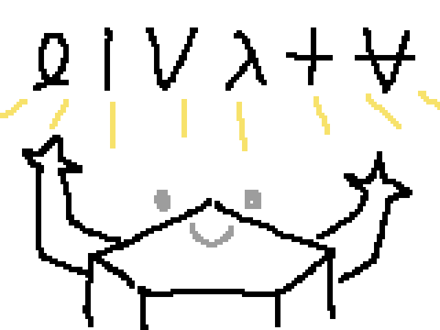

# Project Hail Mary

- `Author`: Andy Weir
- `Translator`: 강동혁
- `Publisher`: 알에이치코리아(RHK)
- `Year`: 2021

## 리뷰

### 1 - 9장

아무것도 모르는 채 깨어난 주인공이 지금 어디에 있는지 알아가는 것, 그리고 과거 기억을 떠올려가는 것을 번갈아 전개하는데 아주 재밌다.
수수께끼 두 개를 동시에 풀게 하면서 질릴 틈 없이 혼을 쏙 뺀다.

주인공 라일랜드 그레이스는 천재끼도 있고 허당끼도 있다. 여느 SF에 비해서 주인공이 시행착오를 겪는 과정을 좀 더 자세히, 과학적으로 보여주는 것도 재밌다.

**아스트로파지**라는 수수께끼를 풀어가는 과정에서 점점 더 많은 수수께끼가 제기되는데,
여기서 좀 소프트한 SF였다면 아마 과학으로 설명 불가능한 미지의 힘에 더 의탁해서 상상력을 자극하는 방식을 택했을 것이다.
그러나 *프로젝트 헤일메리*에서는 생각보다 많은 미스터리에 대해 결국에는 **생각보다 현실적인** 해답이 제시된다.
이게 진짜 SF 같고 아주 좋았다.
딱 **현대 과학으로 알 수 없는 것만 알 수 없는 채 남아있다**는 식으로 선을 그어서, 그 외에는 이야기의 모든 포인트가 과학적으로 해결된다는 느낌이 있다.

책 전체를 돌아봐도, 사실상 답이 없는 질문은 **아스트로파지가 어떻게 에너지를 질량으로 바꾸는지**와 **제노나이트가 어떻게 튼튼한지** 정도이다.
그리고 두 질문 모두 당연히, 저자도 현대 과학으로 설명이 안 될 걸 알고 있으며 애초에 설명하지 않을 생각으로 넣었다는 것이 분명하다.

---

한편 이건 사소한 건데, 저 두 질문 중에 후자는 굳이 제논이라는 원소를 써야 했을까?
화학 문외한 입장에서 오히려 처음 읽을 때 '제노나이트란 건 너무 불가능해 보이고 그냥 Xenon이란 이름이 멋있어서 넣은 것 같은데?'라는 의문이 들면서 살짝 몰입도가 떨어지긴 했다.

참고로 책에 '제논은 비활성기체다. 그 무엇과도 반응하지 않는다. 그 무엇과도 결합하지 않는다. 게다가 제논은 실온에서 기체 상태다.'(216p)라 나오는데,
찾아보니까 [XeF2](https://en.wikipedia.org/wiki/Xenon_difluoride) 등 결합을 잘만 한단다. XeF2는 실온에서 고체다.

그러면 차라리 '결합을 하긴 하니까 제노나이트만큼 강한 물질도 만들 가능성이 있겠다' 식으로 가능성을 좀 더 열어주거나 아니면 다른 원소들이 좀 더 섞인 설정으로 가는 게 낫지 않았을까?

---

그 외에 또 사소한 불만 하나는, 목차 전 맨 앞에 '추진 모드 구조도 / 원심분리기 모드 구조도'라고 그림이 나오는데, 이것 때문에 앞 몇 장 읽을 때 좀 스포당한 기분이 들었다.
미스터리가 좀 풀린 다음에 이 그림이 참고용으로 나오면 더 좋았을 것 같다.

---

제대로 아쉬운 점을 얘기하자면 **스트라트의 캐릭터성**과, **표면적인 언급으로 끝난 주변 인물들**이 있겠다.

에바 스트라트는 처음부터 '이 사람은 엄청난 권력이 있는 사람이다. 그냥 그렇게 받아들이자'라는 컨셉으로 나오는데 그건 재밌다.
다만 이 인물에 대한 배경 설명은 끝까지도 진짜로 안 나오고, 몇몇 부분에서는 그 컨셉에 맞지 않게 행동하는 것 같기도 하다.

처음에 스트라트 급의 인물이 라일랜드를 직접 찾아가서 만날 이유가 있나?
라일랜드한테 실험실을 제공해주고 옆에서 지켜볼 여유가 있나?

*프로젝트 헤일메리* 세계관 상에서 스트라트가 라일랜드를 주목하는 이유는 라일랜드가 제기한 '물을 필요로 하지 않는 생물의 존재 가능성' 이론 때문인데,
이 논문을 한 편 냈다고 학계 전체의 비웃음을 사고 학계를 떠났다가 나중에는 세계적 탑시크릿 조직의 주요 타겟이 되고... 이게 나한테는 신빙성이 떨어진다.
(202p - 203p에서 라일랜드가 다른 과학자들과 말을 다툴 때 '정말 이 논문 한 편에 학계가 이렇게 반응했다고?'라는 느낌이 들었다.)

특히 라일랜드라는 인간이 우주 임무를 수행하기 위한 특성을 갖추고 있단 사실이 이 시점에서는 전혀 드러나지 않았었기 때문에, 돌아보면 말이 안 되는 것 같다.

---

표면적인 언급으로 끝난 주변 인물은 대표적으로 라일랜드와 같이 헤일메리 호를 탔던 승무원 두 명이 있겠다.
야오와 일류키나인데, 생전 모습이 나오진 않고 각자 어떤 성격의 사람이었는지 설명이 한 문단씩 나온다.
우리가 그들에 대해 더 알았더라면 라일랜드가 두 명을 우주로 떠나보내며 마음 아파하는 장면도 더 크게 다가왔을 것 같다.

그 외에도 자잘자잘하게 몇몇 인물들이 초반에 나오는데, 자잘자잘해서 너무 잘 잊힌다.
예를 들어 38p에 라일랜드의 오랜 친구라는 머리사가 나오는데, 배경 설명도 나오고 일상적인 대화도 나와서 인물은 잘 상상된다.
그런데 나중에 다시 등장했는지 기억이 안 난다. 책을 다 읽고 나면 전혀 기억이 나지 않을 것이다.
차라리 몇 명한테 초점을 맞춰서 좀 더 깊이 있는 주변 인물을 만들었다면 어땠을까?

물론, 머리사인지 뭔지가 기억 안 나는 건 큰 문제는 아니다.
10장이 되면 레전더리 신화급 캐릭터, 환상의 포켓몬 로키가 등장하기 때문이다.

### 10 - 19장

 

 

 
 

### 20장 ~
