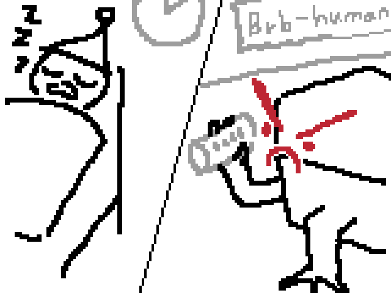
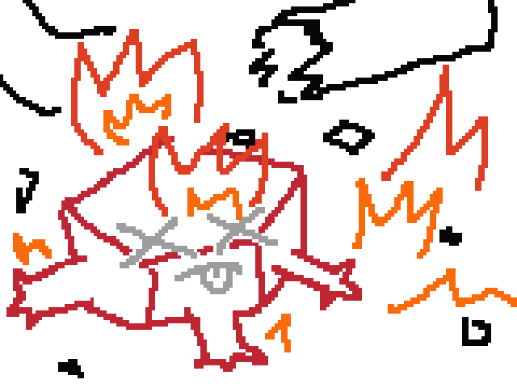

# Project Hail Mary

- `Author`: Andy Weir
- `Translator`: 강동혁
- `Publisher`: 알에이치코리아(RHK)
- `Year`: 2021

## 리뷰

### 1 - 9장

아무것도 모르는 채 깨어난 주인공이 지금 어디에 있는지 알아가는 것, 그리고 과거 기억을 떠올려가는 것을 번갈아 전개하는데 꽤 재밌다.
수수께끼 두 개를 동시에 풀게 하면서 질릴 틈을 없게 한다.

주인공 라일랜드 그레이스는 천재끼도 있고 허당끼도 있다. 여느 SF에 비해서 주인공이 시행착오를 겪는 과정을 좀 더 자세히, 과학적으로 보여주는 것도 재밌다.

**아스트로파지**라는 수수께끼를 풀어가는 과정에서 점점 더 많은 수수께끼가 제기되는데,
여기서 좀 소프트한 SF였다면 아마 과학으로 설명 불가능한 미지의 힘에 더 의탁해서 상상력을 자극하는 방식을 택했을 것이다.
그러나 *프로젝트 헤일메리*에서는 대부분의 미스터리에 대해 결국에는 **생각보다 현실적인** 해답을 제시한다.
이게 진짜 SF 같고 아주 좋았다.
이야기를 위해 필요한 공상과학적 설정에만 딱 "이건 현대 과학으로 알 수 없다"는 식으로 명시를 하고 선을 그어서, 그 외에는 이야기의 모든 포인트가 과학적으로 해결된다는 느낌이 있다.

현대 과학으로 알 수 없다고 명시된 것도 책을 통틀어서 두 개밖에 없는 것 같다. "아스트로파지의 원리(중성미자를 어쩌구... 부분)"와 "제노나이트의 원리" 이렇게 두 개.

---

한편 이건 사소한 건데, 저 두 질문 중에 후자는 굳이 제논이라는 원소를 써야 했을까?
화학 문외한 입장에서 오히려 처음 읽을 때 '제노나이트란 건 너무 불가능해 보이고 그냥 Xenon이란 이름이 멋있어서 넣은 것 같은데?'라는 의문이 들면서 살짝 몰입도가 떨어지긴 했다.

참고로 책에 `(216p) 제논은 비활성기체다. 그 무엇과도 반응하지 않는다. 그 무엇과도 결합하지 않는다. 게다가 제논은 실온에서 기체 상태다.`라 나오는데,
찾아보니까 [XeF2](https://en.wikipedia.org/wiki/Xenon_difluoride) 등 결합을 잘만 한단다. XeF2는 실온에서 고체다.

그러면 차라리 '결합을 하긴 하니까 제노나이트만큼 강한 물질도 만들 가능성이 있겠다' 식으로 가능성을 좀 더 열어주거나 아니면 다른 원소들이 좀 더 섞인 설정으로 가는 게 낫지 않았을까?

---

사소한 불만 또 하나, 목차 전 맨 앞에 '추진 모드 구조도 / 원심분리기 모드 구조도'라고 그림이 나오는데, 이것 때문에 앞 몇 장 읽을 때 좀 스포당한 기분이 들었다.
미스터리가 좀 풀린 다음에 이 그림이 참고용으로 나오면 더 좋았을 것 같다.

---

좀 더 제대로 된 비판거리로는 **스트라트의 캐릭터성**과, **큰 인상을 못 남긴 주변 인물들**이 있겠다.

에바 스트라트는 처음부터 '이 사람은 엄청난 권력이 있는 사람이다. 그냥 그렇게 받아들이자'라는 컨셉으로 나오는데 그건 재밌다.
다만 이 인물에 대한 배경 설명은 끝까지도 진짜로 안 나오고, 몇몇 부분에서는 그 컨셉에 맞지 않게 행동하는 것 같기도 하다.

처음에 스트라트 급의 인물이 라일랜드를 직접 찾아가서 만날 이유가 있나?
라일랜드한테 실험실을 제공해주고 옆에서 지켜볼 여유가 있나?

*프로젝트 헤일메리* 세계관 상에서 스트라트가 라일랜드를 주목하는 이유는 라일랜드가 제기한 '물을 필요로 하지 않는 생물의 존재 가능성' 이론 때문인데,
이 논문을 한 편 냈다고 학계 전체의 비웃음을 사고 학계를 떠났다가 나중에는 세계적 탑시크릿 조직의 주요 타겟이 되고... 이게 나한테는 신빙성이 떨어진다.
(202p - 203p에서 라일랜드가 다른 과학자들과 말을 다툴 때 '정말 이 논문 한 편에 학계가 이렇게 반응했다고?'라는 느낌이 들었다.)

특히 라일랜드라는 인간이 우주 임무를 수행하기 위한 특성을 갖추고 있단 사실이 이 시점에서는 전혀 드러나지 않았었기 때문에, 돌아보면 말이 안 되는 것 같다.

---

큰 인상을 못 남긴 주변 인물은 대표적으로 라일랜드와 같이 헤일메리 호를 탔던 승무원 두 명이 있겠다.
야오와 일류키나인데, 처음에는 짧게만 소개되었다가 라일랜드가 이들에 대한 기억을 되찾아감에 따라 책 후반부에 제대로 등장한다.

라일랜드는 이들을 기억하지 못하는 상황에서도 이들의 죽음에 큰 슬픔을 느끼며 자신이 이들과 가까웠으리라고 짐작한다.
굉장히 의미 있는 감정이지만, 문제는 야오와 일류키나가 누군지 제대로 설명되지 않은 시점에서 비슷한 감정 표현이 두세 번 반복된다는 것이다.
야오와 일류키나에 대한 실제 기억이 그 감정에 맞추어 조금씩 더 주어졌다면 훨씬 효과적이었을 것 같다.

그 외에도 자잘자잘하게 몇몇 인물들이 초반에 나오는데, 자잘자잘해서 너무 잘 잊힌다.
예를 들어 38p에 라일랜드의 오랜 친구라는 머리사가 나왔는데, 이후에는 다시 나왔는지 기억도 안 난다.

책을 다 읽고 나니까, 애초에 라일랜드라는 캐릭터가 '진정한 친구'를 사귀지 못했기 때문에 일부러 잘 잊히는 주변인물이 여럿 나오는구나.. 싶긴 하지만.
초반부를 읽는 동안에는 그걸 모르고 읽으니까, 구심점이 될 캐릭터가 없어 과거편의 흥미가 조금 떨어지는 느낌이었다.

물론, 머리사인지 뭔지가 기억 안 나든 책 전체에서는 아무 문제가 안 된다.
10장이 되면 레전더리 신화급 캐릭터, 환상의 포켓몬 로키가 등장하기 때문이다.

### 10 - 19장

 

 

 
 

### 20장 ~

와 여기부터는 진짜 미쳤다. 반전에 반전에 반전에... 문제에 해결에 문제에 해결에... 초중반부에서 아껴뒀던 감정을 전부 쏟아붓는다. 그런데 논리적이지 않은 전개가 하나도 없다. 허투루 쓰는 설정이 하나도 없다.

엔딩도 정말 대단하다. 독자를 우주선에 태우고 시원섭섭한 작별의 엔딩으로 보내 놓았다가, 급반전 이후 자기 극복과 희생의 숭고한 엔딩으로 보내 놓았다가, 결국에는 주인공의 진정한 정체성, 초반부터 끊임없이 언급되었지만 이런 식으로 보상될 줄은 몰랐던 정체성을 되찾는 자기성취의 엔딩으로 착륙시킨다. 이 수많은 감정이 하나의 감정선으로 이어진다는 게 대단하다. 그 와중에 과학적 방법론의 원칙은 철저히 지켜지고.

후반부에서 아쉬운 점을 찾아보았다. 아쉬운 게 없다. 아니, 꼭 아쉬울 정도는 아니더라도 뭔가 나라면 이런 걸 추가하고 싶다, 할 만한 건 없을까? 샅샅이 찾아보았다.

음, 굳이 꼽자면 주인공이 로키를 살려내려고 고압 펌프를 썼던 행위가, 그냥 판단 미스로만 끝났고 뭔가 의미 있는 이야기 포인트로 이어지지 않았다는 것? 피곤한 주인공의 실수였을 수도 있지만 만약 이때 주인공이 사용했던 과학적 방법이 나중에, 예를 들면 주인공이 1광분 거리에서 블립A를 찾아내야 할 때 뭘 할지에 대한 아이디어를 준다면 두 사건 모두에 (둘 다 이타심에서 비롯된 행위란 점에서) 좀 더 의미가 부여되지 않을까? 뭐 그렇다.

## 평점

> 평점은 읽을 당시의 주관적인 느낌을 숫자라는 틀에 담은 것뿐입니다. 언제든 바뀔 수 있습니다.

### `+4`

- 두 번 읽어도 재밌고 또 읽고 싶다. 그냥 그것만으로 족하다.
- 이 정도로 과학을 문학에 접목시킨 게 있을까 싶다. 뭐 어릴 때 본 과학 학습만화? 안 된다. 뭐 닥터 스톤? 안 된다. 유명한 SF 소설들도 보통 초과학적 현상 하나를 둘러싸고 스토리를 전개하거나 철학적인 얘기를 하거나 하지, 이렇게 매 챕터마다 물화생지가 전부 스토리에 융합된 건 드물다.
- 단순히 '융합시켰다' 뿐이 아니고 그걸 풀어가는 게 수준급이다. '방사선'이 처음으로 플롯 포인트가 될 때 현재편과 과거편을 오가면서 로키에 대한 반전과 아스트로파지의 특성을 동시에 소개하고, 방사선이란 개념도 독자들에게 다각도로 이해시키고, 로키의 문제에 대한 해결책과 앞으로의 떡밥까지 한 번에 만들어낸다. '상대성이론'이 플롯 포인트가 될 때도 마찬가지다.

### `-1`

- 캐릭터성의 부족: 특히 스트라트가 평면적인 인물에 그친 게 아쉬웠다. 초국가적인 프로젝트 리더라는 설정에 대한 신빙성이 떨어지는 묘사도 많았다. 스트라트가 라일랜드를 사실상 2인자로 삼게 되는 과정도 다 믿으려면 불신의 유예를 좀 많이 해야 한다. 나는 애니를 봐서 이런 쪽으로는 불신의 유예 전문가기 때문에 괜찮다.
- 스토리상 너무 쉽게 해결되고 넘어가는 문제들이 있다. 지구상에서 헤일 메리 호를 쏘기 전까지 벌어진 대부분의 정치적 문제가 그렇고, 주인공의 능력 관련 문제들도 일부 그렇다. 이 쪽으로도 불신의 유예를 많이 해야 한다. 그리고 주인공이 로키를 만난 지 몇 주도 안 되어서 언어를 꽤 잘 알아듣게 되고 절대음감도 생겼다는데... `(394p) 나는 주파수 분석기가 더 이상 필요하지 않다. 방금 소리는 낮은 라, 가온 도, 장 5음에 이어진 미 플랫 옥타브와 G단조 7음이었다.` 이러는데 뒷부분이 그냥 음악적으로 말이 안 되는 문장이라서 주인공이 농담을 한 건지 작가가 신경을 안 쓴 건지 잘은 모르겠다.
- 로키와 주인공 사이에 뭔가 의미 있는 갈등과 해결이 없었던 것도 아쉽다. 401p에서 `우리는 문화적인 문제를 그냥 받아들이기로 암묵적 합의를 했다. (...) 서로의 문화가 충돌하는 상황은 한 번도 맞닥뜨리지 못했다. 아직은.`이라 해서 나는 당연히 떡밥인 줄 알았다.
