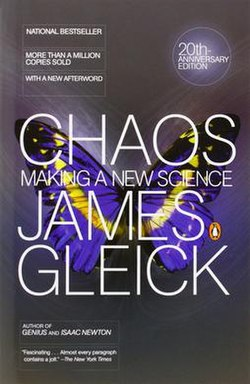

# Chaos: Making a New Science

- `Author`: James Gleick
- `Publisher`: Penguin Books
- `Year`: 2008 (Original edition: 1988)

> 주의: 요약과 문장 번역을 제 마음대로 하기 때문에 부정확할 수 있습니다.

## Prologue

1970년대 '카오스'는 전 세계에서 몇 명 만이 드문드문 다루는 것이었다.

1980년대 카오스 이론은 급격히 성장하는 큰 분야가 되었고, 과학 어디에서나 등장하는 이론이 되었다.

20세기의 큰 과학적 혁명 중 하나로 평가되기도 하는 이 새로운 과학이 만들어지는 데에 어떤 역사가 있었을까?

> (6p) "Relativity eliminated the Newtonian illusion of absolute space and time; quantum theory eliminated the Newtonian dream of a controllable measurement process; and chaos eliminates the Laplacian fantasy of deterministic predictability."
>
> "뉴턴(역학)이 상상했던 절대적인 시간과 공간의 개념은 상대성이론에 의해 무너졌다. 뉴턴이 꿈꿨던 통제된 측정 기술은 양자역학에 의해 무너졌다. 그리고 라플라스가 상상했던 결정론적 예측 가능성은 카오스에 의해 무너졌다."

20세기 후반 입자물리에 집중되며 큰 발전이 없던 물리학 -> 카오스 이론은 다시 한 번 일상 수준(구름, 파도, ...)에서 물리학이 배울 것이 많다는 것을 알림. '혼돈'과 '질서'의 만남.

현대 카오스 이론의 시발점은 60년대 '나비효과'의 발견.

## The Butterfly Effect

1960년 [Edward Lorenz](https://en.wikipedia.org/wiki/Edward_Norton_Lorenz)는 컴퓨터로 날씨 시뮬레이션을 만든다.

당시 기상학 학계에서는 '정답이 있는' 문제들이 주류였고, 날씨 예측은 사짜 과학으로 여겨졌다.

다만 충분히 강력한 컴퓨터를 사용한다면, 과학자들이 우주선의 궤도를 정확하게 예측하는 것과 마찬가지로 바람과 구름의 움직임도 예측할 수 있지 않을까? 하는 생각도 있었을 것이다.

(뉴턴 역학에 영향받은) 18세기 [Laplace](https://en.wikipedia.org/wiki/Pierre-Simon_Laplace)의 상상: 고도의 지능으로 온 우주의 원자들부터 별까지 동작을 이해한다면 모든 과거와 미래를 확실하게 알 것이다.

당시 과학에는 라플라스의 영향이 있었다. '어떤 System(계)의 초기 조건을 정확히 안다면 그 계의 움직임도 정확히 알 수 있다'는 철학. 다만 초기 조건을 완벽히 측정하는 건 불가능하므로, '**어떤 계의 초기 조건을 대략적으로 안다면 그 계의 움직임도 대략적으로 알 수 있다**'는 철학.

> (15p) "The basic idea of Western science is that you don't have to take into account the falling of a leaf on some planet in another galaxy when you're trying to account for the motion of a billiard ball on a pool table on earth. Very small influences can be neglected. There's a convergence in the way things work, and arbitrarily small influences don't blow up to have arbitrarily large effects."
>
> "서구 과학의 기본 아이디어는, 지구에서 당구대 위 당구공의 움직임을 계산할 때 어디 다른 은하에 있는 행성에서 낙엽이 떨어지는 걸 고려할 필요는 없다는 것이다. 아주 작은 영향은 무시할 수 있다. 세상이 움직이는 데엔 수렴성이 있고, 임의의 작은 영향에서 임의의 큰 효과가 일으켜지지는 않는다."

로렌츠도 날씨 시뮬레이션의 양상을 보며 날씨에 관한 원리를 알아내고자 했다. 시뮬레이션에서는 비슷한 패턴이 반복되는 경우가 있었으나, 정확히 똑같이 반복되지는 않았다.

1961년 어느 날, 로렌츠는 날씨 시뮬레이션 중 한 부분을 분석해보고자 특정 시기의 값들을 컴퓨터에 다시 입력한 다음 똑같은 시뮬레이션을 한 번 더 돌렸다. 그런데 어느 정도 시간이 지나자 원래의 시뮬레이션과 새 시뮬레이션이 전혀 다른 양상을 보였다! 이유는 로렌츠가 컴퓨터에 값들을 입력할 때, 소수점 이하 아주 작은 값들은 생략했기 때문이었다.

> (17p) Lorenz could have assumed something was wrong with his particular machine or his particular model (...) But for reasons of mathematical intuition that his colleagues would begin to understand only later, Lorenz felt a jolt: something was philosophically out of joint.
>
> 로렌츠는 그가 사용한 장비나 그의 모델에 문제가 있다고 생각할 수도 있었다 (...) 그러나 그의 수학적인 직관이, 그의 동료들은 나중에 가서야 이해할 수 있을 이유로 인해, 로렌츠의 가슴을 철렁이게 했다. 여기엔 무언가 철학적인 수준에서 어긋나 있었다.

시뮬레이션에 사용한 수식 중 **초기 조건에 민감**하고 주기성이 없는(aperiodic) 것들을 발견 - 나비효과.

- 나비효과: 산꼭대기에 공을 놓을 때 놓는 지점이 약간만 달라져도 공이 정반대편으로 굴러갈 수 있음. 이때 산꼭대기와 같은 지점을 불안정한 임계점(critical point)이라 부름.

5~60년대 위성과 컴퓨터의 발달: 컴퓨터 모델로 많은 것을 예측하려는 기류([Von Neumann](https://en.wikipedia.org/wiki/John_von_Neumann)). **나비효과**도 날씨 통제에 오히려 이용될 수 있다는 생각 - 인간이 기후에 작은 변화를 줌으로써 날씨를 원하는 대로 바꿀 수 있지 않을까? 라는 생각.

그러나 로렌츠의 발견은 달랐다. 날씨는 **매 순간이 불안정한 임계점**이고, 인간이 기후에 작은 변화를 주었을 때 일정 기간 이후 무슨 일이 일어날지는 전혀 예측할 수 없다는 것.

로렌츠는 **비선형 방정식** 단 3개로 이루어진 시스템에서도 이러한 복잡한 행동을 발견한다.

- 선형(linear): `y = 3x`처럼 두 변수가 정확히 비례하는(1차함수로 나타내어지는) 관계.
- 비선형(nonlinear): 그 외의 모든 관계.

비선형 방정식은 풀기 어렵기 때문에 대부분 과학에서 해결하고자 하는 건 선형 방정식이다. 그러나 비선형 방정식은 훨씬 복잡하고 흥미로운 관계를 표현할 수 있다. (예시: 유체 역학의 근간이 되는 **나비에-스토크스 방정식**.)

로렌츠의 3개의 식은 대류(convection)현상을 단순화한 것으로, [Malkus waterwheel](https://youtu.be/Lh1iGSCD8II)을 표현한 것과 같다. 카오스 이론 이전에는 이 정도로 단순한 시스템은 단순하고 예측 가능하게 행동한다는 게 물리학자들의 직관이었다. 그러나 물이 충분히 세면 이 물레바퀴의 속도나 방향은 일정해지지도 않고, 주기성을 가지지도 않는다.

[Lorenz Attractor](https://marksmath.org/visualization/LorenzExperiment/): 로렌츠의 시스템에서 각 변수들이 시간에 따라 어떻게 변하는지 궤적을 그려본 것. 단순한 모양을 그리지 않고 변화무쌍한 패턴을 보인다.

당시에 이 연구는 즉시 널리 알려지지는 않았고, 이 연구가 매우 중요한 것이라 생각한 사람도 드물었다.

## Revolution

[Thomas S. Kuhn](https://en.wikipedia.org/wiki/Thomas_Kuhn)의 주장: 과학은 질문을 하고 답하면서 선형적으로 나아가는 학문이 아니다. 잘 알려진 문제를 재확인하는 대부분의 '일반적인' 과학이 있는가 하면, 혁명으로 이어지는 예외적이고 비일상적인 과학이 있다.

> (37p) Every scientist who turned to chaos early had a story to tell of discouragement or open hostility.
>
> 초창기 카오스에 눈을 돌린 모든 과학자들에게는 좌절이나 적개심을 마주했던 이야기가 있다.

Benjamin Franklin 시절 전기를 대하듯이, 초기 카오스는 과학을 기초부터 다시 세우듯이 발전했다.

> (39p) To avoid boring their colleagues, scientists routinely begin and end their papers with esoterica. By contrast, articles on chaos from the late 1970s onward sounded evangelical, from their preambles to their perorations.
>
> 과학자들은 보통 동료들이 지루해하지 말라고, 논문의 시작과 끝을 난해한 전문지식으로 장식한다. 이에 반해 1970년대 카오스에 대한 글은 처음부터 끝까지 어떤 종교의 전도자 같았다.

#### **진자(pendulum)를** 통해 보는 패러다임의 변화

아리스토텔레스: 진자에서 '가장 자연스러운 상태'인 땅을 향해 움직이려는 공을 봄.

갈릴레오: 진자에서 측정 가능한 주기성을 봄. 근대까지 이어진 이 계통의 과학에서는 쉽게 측정 가능한 것을 연구 대상으로 삼았고, 비선형 방정식 등은 무시하거나 예외적인 것으로 생각함.

카오스: 진자에서도 예측 불가능한 복잡한 운동을 발견함.

위상수학 분야의 석학 [Stephen Smale](https://en.wikipedia.org/wiki/Stephen_Smale)은 1960년대에 **동역학** 연구를 시작한다. [Poincaré](https://en.wikipedia.org/wiki/Henri_Poincar%C3%A9)는 일찍이 두 분야를 동전의 양면으로 보았고, 기하학적 상상을 현실 물체의 운동에 접목시키고자 하였다.

처음 스메일은 '안정적인 식'들을 만들고 그것들로 카오스를 근사시키고자 하였으나 실패했다. '카오스'와 '불안정한 것'은 전혀 다른 것이었다.

- 불안정하지만 카오스가 아닌 것: '연필을 거꾸로 세우기' 등. 연필의 무게중심은 수학적으로 계산할 수 있지만, 작은 변화에도 넘어지기 때문에 불안정.
- 안정적인 카오스: 로렌츠의 시스템 등. 시스템에 작은 변화를 주어도 Lorenz Attractor 그래프의 모습 자체는 큰 변화가 없고 비슷한 패턴을 그린다.
 'Locally unpredictable, globally stable'(국소적으로는 예측 불가능하고, 전체적으로는 안정적)

스메일은 어떤 시스템의 식들을 변화시킬 때 **위상 공간**이 어떻게 변하는지 조사함.

- 위상 공간: 어떤 시스템에 존재하는 변수들이 노는 운동장. 예를 들어 '진자'라는 시스템에는 '진자의 각도'와 '진자의 속도'라는 두 변수가 있고, 특정 시점의 '각도'와 '속도'를 x와 y라 하면 2차원 평면이라는 위상 공간 위의 점으로 나타낼 수 있다. 시간에 따라 진자의 각도와 속도가 변하면 2차원 평면 위에 그래프가 그려진다.

스메일은 [Horseshoe map](https://en.wikipedia.org/wiki/Horseshoe_map)이라는 개념을 이용해 카오스를 설명할 위상수학적 기반을 마련했다. 수타면을 늘이고 접으며 여러 가닥 면발을 만드는 것을 무수히 반복하면, 처음 반죽에서 가까이 있던 두 점도 나중에 가서는 가까이 있을지 멀리 있을지 예측 불가능하게 된다.

한편 [Philip Marcus](https://scholar.google.com/citations?user=CHlcHGMAAAAJ&hl=en)는 시뮬레이션을 통해 목성의 대적점이 안정적으로 유지되는 것이 카오스 동역학계에서 가능함을 밝혔다.

## Life's Ups and Downs

## A Geometry of Nature

## Strange Attractors

## Universality

## The Experimenter

## Images of Chaos

## The Dynamical Systems Collective

## Inner Rhythms

## Chaos and Beyond

## Afterword

