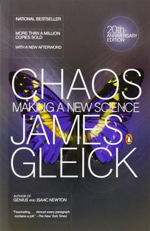
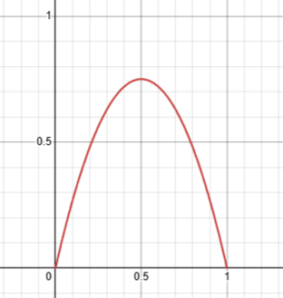

# Chaos: Making a New Science

- `Author`: James Gleick
- `Publisher`: Penguin Books
- `Year`: 2008 (Original edition: 1988)

> 주의: 요약과 문장 번역을 제 마음대로 하기 때문에 부정확할 수 있습니다.

## Prologue

1970년대에는 거의 아무도 몰랐던 카오스 이론.

1980년대 카오스 이론은 급격히 성장해, 과학 어디에서나 등장하는 이론이 되었다.

20세기의 과학적 혁명 중 하나로 평가되기도 하는 이런 이론이 어떻게 만들어졌을까?

> (6p) "Relativity eliminated the Newtonian illusion of absolute space and time; quantum theory eliminated the Newtonian dream of a controllable measurement process; and chaos eliminates the Laplacian fantasy of deterministic predictability."
>
> "뉴턴이 상상했던 절대적인 시간과 공간의 개념은 **상대성이론**에 의해 무너졌다. 뉴턴이 꿈꿨던 통제된 측정 기술은 **양자역학**에 의해 무너졌다. 그리고 라플라스가 상상했던 결정론적 예측 가능성은 **카오스**에 의해 무너졌다."

> _**자이**: 새로운 과학 3종을 단순하게 나누면, 상대성이론을 **아주 큰 세상**에 적용되는 과학, 양자역학을 **아주 작은 세상**에 적용되는 과학이라 할 수 있고, 카오스 이론은 **일상 수준**의 세상에도 적용되는 과학이라 할 수 있음. (구름, 파도...)_

## 1. The Butterfly Effect

> *주인공: [Edward Lorenz](https://en.wikipedia.org/wiki/Edward_Norton_Lorenz)* 에드워드 로렌츠
>
> _알아야 좋은 개념: 계([링크 1](https://ko.wikipedia.org/wiki/%EC%8B%9C%EC%8A%A4%ED%85%9C), [링크 2](https://ko.wikipedia.org/wiki/%EB%AC%BC%EB%A6%AC%EA%B3%84)), 일차함수, 좌표공간_

현대 카오스 이론의 시발점.

1950~60년대에는 위성과 컴퓨터가 발달하며 컴퓨터로 여러가지 예측을 하려는 시도가 많았다([Von Neumann](https://en.wikipedia.org/wiki/John_von_Neumann)).

1960년 로렌츠는 컴퓨터로 날씨 시뮬레이션을 만든다.

당시 기상학계에선 **정답이 있는** 문제들이 주류였고, 날씨 예측은 사짜 과학으로 여겨졌다. 다만 "강력한 컴퓨터를 사용한다면, 우주선 궤도를 예측하는 것처럼 바람과 구름의 움직임도 예측할 수 있지 않을까?" 하는 사람들도 있었을 것이다.

- 18세기 [Laplace](https://en.wikipedia.org/wiki/Pierre-Simon_Laplace)의 상상: "고도의 지능으로 우주의 모든 원자부터 별까지의 동작을 이해한다면 모든 과거와 미래를 확실하게 알 것이다."

당시 과학계의 생각도 '어떤 계(System)의 초기 조건을 정확히 안다면 그 계의 미래 움직임도 정확히 알 수 있다'는 것이었다. 다만 초기 조건을 완벽히 정확하게 측정하는 건 불가능하므로, 대신 '**어떤 계의 초기 조건을 대략적으로 안다면 그 계의 미래 움직임도 대략적으로 알 수 있다**'고 보통 생각했다.

> (15p) "The basic idea of Western science is that you don't have to take into account the falling of a leaf on some planet in another galaxy when you're trying to account for the motion of a billiard ball on a pool table on earth. Very small influences can be neglected. There's a convergence in the way things work, and arbitrarily small influences don't blow up to have arbitrarily large effects."
>
> "서구 과학의 기본 아이디어는, 지구에서 당구대 위 당구공의 움직임을 계산하는데 어디 다른 은하의 행성에서 낙엽이 떨어지는 걸 고려할 필요는 없다는 것이다. 아주 작은 영향은 무시해도 된다. 세상은 수렴하는 경향이 있고, 임의의 작은 영향에서 생각 이상의 큰 효과가 일으켜지지는 않는다."

로렌츠는 날씨 시뮬레이션을 보며 날씨의 원리를 알아내고자 했다. 시뮬레이션에서는 비슷한 날씨 패턴이 반복될 때도 있지만, 정확히 똑같이 반복되지는 않았다.

### ◆ 날씨 시뮬레이션에서 카오스 발견

1961년 어느 날, 로렌츠는 날씨 시뮬레이션 중 한 부분을 분석해보고자 특정 시기의 값들을 컴퓨터에 다시 입력한 다음, 똑같은 시뮬레이션을 한 번 더 돌렸다. 그런데 어느 정도 시간이 지나자 원래의 시뮬레이션과 새 시뮬레이션이 전혀 다른 양상을 보였다! 이유는 로렌츠가 컴퓨터에 값들을 입력할 때, **소수점 이하 아주 작은 숫자들은 생략**했기 때문이었다.  당시의 일반적인 생각으로는 초기 조건이 아주 약간 달랐다면, 결과도 아주 약간만 달랐어야 했다.

> (17p) Lorenz could have assumed something was wrong with his particular machine or his particular model (...) But for reasons of mathematical intuition that his colleagues would begin to understand only later, Lorenz felt a jolt: something was philosophically out of joint.
>
> 로렌츠는 그가 사용한 장비나 그가 세운 모델에 문제가 있다고 생각할 수도 있었다 (...) 그러나 로렌츠의 수학적인 직관이 그의 가슴을 철렁이게 했다. 그의 동료들은 나중에서야 이해하게 될 만한 것이었다. 그 결과는 무언가 철학적인 수준에서 어긋나 있었다.

로렌츠는 **초기 조건에 민감**하고 **주기성이 없는(aperiodic)** 날씨 시뮬레이션이 일어나는 이유가 뭔지를, 시뮬레이션을 관장하는 수식 속에서 찾았다.

- **나비효과**: 산꼭대기에 공을 놓을 때 놓는 지점이 약간만 달라져도 공은 정반대편으로 굴러갈 수 있다. 이때 산꼭대기와 같은 지점을 불안정한 **임계점**(critical point)이라 부르고, 이렇게 초기 조건에 따라 결과가 크게 바뀌는 걸 **나비효과**라 부른다.

불안정한 임계점이 있을 때 초기 조건에 따라 결과가 크게 바뀔 수 있다는 건 이미 알려진 사실이었다. 당시 일반적으로는 **나비효과**를 보더라도, 오히려 "그러면 인간이 기후에 작은 변화를 줌으로써 날씨를 원하는 대로 바꿀 수 있지 않을까?"라고 긍정적으로 생각했을 것이다. 그러나 로렌츠가 알아낸 것은 달랐다.

> _**자이**: 산꼭대기의 비유에서는 불안정한 임계점이 딱 1개였다. 즉 공을 왼쪽에 놓으면 왼쪽으로 굴러가고, 오른쪽에 놓으면 오른쪽으로 굴러간다. 날씨 시뮬레이션은 이것과 비교가 불가능했다. 초기 입력 값이 0.000001일 때, 0.000002일 때, 0.000003일 때 결과가 전부 완전히 다르다. 그보다 아무리 작은 차이라도, 0.0000001이라도, 0.000000000001이라도 차이가 있기만 하면 결과가 완전히 달라진다._

즉 날씨는 **모든 값에서 불안정한 임계점을 가진다.** 그래서 인간이 기후에 작은 변화를 주었을 때 일정 기간 이후 무슨 일이 일어날지는 전혀 예측할 수가 없다. 변화를 얼마나 주었는지 완벽하게 정확히 측정하는 것이 불가능하므로.

> _**자이**: 산꼭대기 비유에서는 불안정한 임계점이 이산적으로 존재한다(개수를 셀 수 있다). 날씨 시뮬레이션에서는 불안정한 임계점이 연속적으로 존재한다(개수를 셀 수 없다, 어떤 **구간**에 있는 모든 점이 불안정한 임계점이다). 후자와 같은 상황을 **카오스**라 부른다._

### ◆ 로렌츠의 계

로렌츠는 날씨 시뮬레이션보다 훨씬 단순한, **비선형 방정식** 단 3개로 이루어진 계에서도 이러한 복잡한 양상을 발견한다.

- **선형**(linear): `y = 3x`처럼 두 변수가 비례하는(1차함수로 나타내어지는) 관계.
- **비선형**(nonlinear): 그 외의 모든 관계.

이전에는 3개의 식만으로 이루어진 계라면 단순하고 예측 가능하게 움직일 거라는 게 물리학자들의 직관이었다.

3개의 식은 대류 현상을 단순화한 것으로, [Malkus waterwheel](https://youtu.be/Lh1iGSCD8II)이라는 물레바퀴의 움직임을 수식으로 표현한 것과 같다. 이 물레바퀴는 물을 세게 틀면 속도나 방향이 일정하지도 않고 주기적이지도 않게 움직인다.

비선형 방정식은 풀기 어렵기 때문에 대부분 과학에서 해결하고자 하는 건 선형 방정식이다. 그러나 비선형 방정식은 훨씬 복잡하고 흥미로운 관계를 표현할 수 있다. (예시: 유체 역학의 근간이 되는 **나비에-스토크스 방정식**은 비선형이다.)

### ◆ 참고자료

- [Lorenz System](https://en.wikipedia.org/wiki/Lorenz_system): 로렌츠가 발견한, 비선형 방정식 3개가 관장하는 계. 방정식 3개는 다음과 같다. (`σ, ρ, β`의 값을 우리가 정한다. 그러면 `x, y, z`가 시간에 따라 변한다. `x', y', z'`은 각각 `x, y, z`를 시간에 따라 미분한 것이다.)
  - `x' = σ(y - x)`
  - `y' = x(ρ - z) - y`
  - `z' = xy - βz`

- [Lorenz Attractor](https://marksmath.org/visualization/LorenzExperiment/): Lorenz System에서 `(x, y, z)`가 시간에 따라 어떻게 변하는지 3차원 상에 궤적을 그려본 것. 단순한 모양을 그리지 않고 변화무쌍한 패턴을 보인다. 

- [Deterministic Nonperiodic Flow](https://journals.ametsoc.org/view/journals/atsc/20/2/1520-0469_1963_020_0130_dnf_2_0_co_2.xml): 해당 개념을 발견한 로렌츠의 1963년 논문.

당시에 이 연구는 즉시 널리 알려지지는 않았고, 이 연구가 매우 중요한 것이라 생각한 사람도 드물었다.

## 2. Revolution

> *주인공: [Stephen Smale](https://en.wikipedia.org/wiki/Stephen_Smale)* 스티븐 스메일

[Thomas S. Kuhn](https://en.wikipedia.org/wiki/Thomas_Kuhn): 과학은 질문을 하고 답하면서 선형적으로 나아가는 학문이 아니다. 잘 알려진 문제를 재확인하는 대부분의 '일반적인' 과학이 있는가 하면, 혁명으로 이어지는 예외적이고 비일상적인 과학이 있다.

> (37p) Every scientist who turned to chaos early had a story to tell of discouragement or open hostility.
>
> 초창기 카오스에 관심을 준 모든 과학자들이 좌절하거나 적개심을 마주했던 경험을 이야기할 수 있을 것이다.

Benjamin Franklin 시절에 전기가 혁명을 일으켰듯이, 카오스 이론은 마치 과학을 기초부터 다시 세우듯하며 발전했다.

> (39p) To avoid boring their colleagues, scientists routinely begin and end their papers with esoterica. By contrast, articles on chaos from the late 1970s onward sounded evangelical, from their preambles to their perorations.
>
> 과학자들은 보통 동료들이 지루해하지 말라고, 논문의 시작과 끝을 난해한 전문지식으로 장식한다. 이에 반해, 1970년대 이후 카오스에 대한 논문은 처음부터 끝까지 어떤 종교를 전도하듯이 쓰인 것 같았다.

### ◆ 진자(pendulum)를 통해 보는 과학 패러다임의 변화

> _**자이**: 진자는 단순히 실에 매달려 흔들리는 물체다. 과거부터 물리학 하면 떠오르는 가장 단순하고 상징적인 실험 도구 중 하나다. 그러나 진자를 본 과학자가 무슨 생각을 하는지는 과학 패러다임에 따라 변화해 왔다._

- **아리스토텔레스**: 진자를 보고 공이 '가장 **자연스러운** 상태'인 땅을 향해 움직이려 한다 생각했다.

- **갈릴레오**: 진자에서 측정 가능한 **주기성**을 보았다. 근대까지 이어진 이러한 과학에서는 **쉽게 측정 가능**한 것을 연구 대상으로 삼았고, (비선형 방정식 등)그 외의 것은 무시하거나 예외적인 것으로 생각했다.

- **카오스 이론**: 측정이 어려운 것들은 예외적인 것이 아니라 오히려 일반적인 것이란 걸 발견했다. 가장 단순해보이는 진자에서도 **예측이 불가능**한 복잡한 운동을 발견했다.

### ◆ 스메일의 (틀린) 가설

[Poincaré](https://en.wikipedia.org/wiki/Henri_Poincar%C3%A9)는 일찍이 위상수학과 동역학을 동전의 양면으로 보았고, 기하학적 상상(위상수학)을 현실 물체의 운동(동역학)에 접목시키고자 하였다.

위상수학의 석학 스티븐 스메일은 1960년대에 **동역학** 연구를 시작한다.

처음 스메일은 어떤 물체들의 운동이든 **시간이 충분히 지나면 '별로 특이하지 않은' 상태로 접어든다**고 생각했다.

> _**자이**: 예를 들어 "연필을 거꾸로 세운 상태"는 작은 변화에도 어느 쪽으로든 다르게 넘어질 수 있기 때문에 불안정하지만, 그런 특이한 상태가 넘어진 다음에도 계속될 수는 없는 것이다._

다시 말해, 어떤 물체의 움직임이 지속적으로 특이한 상태에 있을 수는 없고, 지속적으로 뭔가 패턴을 보이면 그건 이미 안정된 상태에 접어든 것이란 생각이다.

**그러나 이런 생각은 잘못된 것이었다.** 예를 들어 1장의 **Lorenz System**의 경우, `(x, y, z)`의 값이 분명 초깃값에 민감하게 반응하며 예측할 수 없게 움직이기는 하지만, 지속적으로 커다란 나비같은 모양을 그리며 움직인다.

> 'Locally unpredictable, globally stable'(국소적으로는 예측 불가능하지만, 전체적으로는 안정적)

즉, **카오스**라고 **불안정**(Unstable)한 건 아니다. 둘은 다른 개념이었다.

### ◆ 스메일의 업적

스메일은 어떤 계를 관장하는 식들을 변화시킬 때 **위상 공간**이 어떻게 변하는지 조사했다.

- **위상 공간**: 어떤 계에 존재하는 변수들이 노는 운동장. 예를 들어 '진자'라는 계에는 '진자의 각도'와 '진자의 속도'라는 두 변수가 있다. 특정 시점의 '각도'를 `x`, '속도'를 `y`라 하면 `(x, y)`는 2차원 평면 위의 점이 된다. 이때 2차원 평면을 위상 공간이라 한다. 시간에 따라 진자의 각도와 속도가 변하면 2차원 평면(위상 공간) 위에 그림이 그려진다.

> _**자이**: 기존에는 이런 계에서 "그림 한 장이 어떻게 생겼는지"에 초점을 두었었다면, 스메일은 계를 관장하는 식들을 변화시킴에 따라 "그림 전체가 어떻게 변하는지"를 연구했다고 생각할 수 있다. 그림 전체를 늘리거나 줄이거나 접는 기하학적인 조작은 위상수학이라는 분야와 큰 관련이 있다._

스메일은 [Horseshoe map](https://en.wikipedia.org/wiki/Horseshoe_map)이라는 개념을 이용해 카오스를 설명할 위상수학적 기반을 마련했다. 수타면을 늘이고 접으며 여러 가닥 면발을 만드는 것을 무수히 반복하면, 처음 반죽에서 가까이 있던 어떤 두 점이라도 나중에 가서는 가까이 있을지 멀리 있을지 예측 불가능하게 된다. 이는 카오스 계에서 초깃값이 조금만 달라져도 예측이 불가능해지는 것과 마찬가지다.

스메일의 발견은 그 자체로는 물리학에 바로 적용할 수는 없었지만, 현실과 전혀 동떨어져 있다고 생각된 위상수학이라는 분야에서 현실의 동역학으로 다리를 놓았다는 의의가 있다.

안정적인 카오스는 매우 중요한 개념이다. 예를 들어 목성의 대적점은 천문학의 미스테리 중 하나이다. 이전에는 목성의 대적점이 계속 유지된다는 점에서 폭풍으로 해석하기가 어려웠는데, 폭풍과 같은 카오스적인 계에서도 안정적인 형태가 유지되는 것이 가능하다면 해석할 수 있는 방법이 하나 더 느는 셈이다.

### ◆ 참고자료

- [Van der Pol oscillator](https://en.wikipedia.org/wiki/Van_der_Pol_oscillator): 진자 운동의 일종으로 카오스적인 양상을 보인다. 스메일이 위상 공간 관련 연구를 하는 데에 참고했다.

- [Philip Marcus](https://scholar.google.com/citations?user=CHlcHGMAAAAJ&hl=en): 시뮬레이션을 통해 카오스 동역학계에서 목성의 대적점이 안정적으로 유지되는 것이 가능함을 밝혔다.

## 3. Life's Ups and Downs

> *주인공: [Robert May](https://en.wikipedia.org/wiki/Robert_May,_Baron_May_of_Oxford) 로버트 메이, [James Yorke](https://en.wikipedia.org/wiki/James_A._Yorke) 제임스 요크*
>
> 알아야 좋은 개념: 이차함수

### ◆ 로버트 메이와 로지스틱 사상

생태계는 너무 복잡하여 수식으로 표현할 방법이 마땅치 않다. 데이터를 기반으로 '올해의 개체수가 얼마면 내년의 개체수가 얼마다'라는 표를 만들어볼 수는 있었지만 이는 선형 관계로는 나타낼 수 없다.

- 현재 개체수가 적으면 내년 개체수는 잘 증가한다.
- 현재 개체수 너무 많으면 내년 개체수는 포화되거나 감소한다.
- x=현재 개체수, y=내년 개체수라 할 때, 단순화하면 위로 볼록한 이차함수 꼴이 된다.

- 그래프가 `(0, 0)`과 `(1, 0)`을 지나고, `x=1/2`일 때 `y`가 최대라 하자. 그러면 `y = rx(1-x)` 꼴의 함수가 된다. (`r`은 성장률을 나타내는 상수)

- Logistic difference equation 또는 Logistic map(로지스틱 사상): `y = rx(1-x)` 꼴의 함수.

특정 `x`값에 로지스틱 사상을 반복 적용하자. 그러면 처음 개체수에서 시간이 지나면서 개체수가 어떻게 바뀌는지가 쭉 나오게 된다. 수학에 배경이 있는 생물학자 로버트 메이는, `r`의 값에 따라 개체수 변화 양상이 달라진다는 걸 발견했다.

- `r < 3`인 경우, 개체수는 한 값으로 수렴한다.
- `3 < r < 3.44949..`인 경우, 개체수는 2개의 값 사이를 왔다갔다한다.
- `3.44949.. < r < 3.54409..`인 경우, 개체수는 4개의 값 사이를 왔다갔다한다.
- ...
- `3.56995.. < r < 4`인 경우, 대부분의 r의 값에 대해 개체수는 주기성을 보이지 않고 카오스적으로 변화한다.

> [Logistic Map 변화](https://www.desmos.com/calculator/obw2qfigkf): r의 값에 따라 `y = rx(1-x)`가 시간이 지나면 어떻게 변하는지 표시한 것. 그림에서 가로축이 "r의 값"이고, 세로축이 "어떤 값으로 수렴하는지" 나타낸 것이다.
>
> 
>
> `r < 3`이면 값이 1개, `3 < r < 3.44949..`면 값이 2개인 걸 확인할 수 있다. `3.56995.. < r < 4`이면 거의 대부분이 빽빽하게 색칠되어 있는데, 어느 값으로도 수렴하지 않고 무작위로 변화한다는 뜻이다.

카오스 이론이라는 새로운 '언어'가 등장하기 이전에는 로지스틱 사상이 보이는 카오스적 성질은 전혀 주목을 받지 못했다. '안정적인 성질'만이 과학의 대상이었고, 그렇지 않은 것은 오류라고 간주되었을 것이다.

### ◆ 제임스 요크와 카오스

수학자 제임스 요크는 1972년에 로렌츠의 논문(1장)을 접하고, 스메일(2장)을 비롯해 물리학계에 알린다. 요크는 물리학이 '미분방정식으로 나타내고 해를 구할 수 있는 문제'만 다루기 때문에 비선형 시스템을 등한시했다고 생각했다.

실상, 비선형 시스템(비선형 방정식으로 이루어진 계)은 특수한 것이 아니다. 오히려 자연의 대부분은 비선형이고, 우리가 그 동안 특수하게 깔끔한 문제들만 물리학에서 다루고 있던 셈이다.

> (68p) "(...) people have to know about disorder if they are going to deal with it. The auto mechanic who doesn't know about sludge in valves is not a good mechanic." (...) Scientists and nonscientists alike, Yorke believed, can easily mislead themselves about complexity if they are not properly attuned to it. Why do investors insist on the existence of cycles in gold and silver prices? Because periodicity is the most complicated orderly behavior they can imagine. When they see a complicated pattern of prices, they look for some periodicity wrapped in a little random noise. And scientific experimenters, in physics or chemistry or biology, are no different.
>
> "(...) 무질서를 다루려면 무질서에 대해 알아야 한다. 밸브에 쌓인 진흙에 대해 모르는 정비공은 좋은 정비공이 아니다." (...) 요크는 과학자든 비과학자든, 복잡성이란 것을 제대로 알지 못하면 오류에 빠지기 쉽다고 믿었다. 왜 투자자들은 금과 은 가격에 사이클이 있다고 주장하는가? 주기성을 띤 현상이 그들이 생각할 수 있는 질서 안에서 가장 복잡한 것이기 때문이다. 그들은 복잡한 패턴으로 움직이는 가격을 보고, 약간의 노이즈로 둘러싸인 어떤 주기성을 찾고자 한다. 그리고 실험과학자들도, 물리학이든 화학이든 생물학이든, 이와 다르지 않다.

요크는 의미심장한 이름의 논문 [Period Three Implies Chaos](https://www.its.caltech.edu/~matilde/LiYorke.pdf)로 **카오스**라는 용어를 창시한다. 이 논문은 로버트 메이의 연구를 일반화한 것으로, `y = rx(1-x)`꼴의 함수 뿐 아니라, 어떤 방식으로든 '3번마다 x가 같은 값으로 돌아오게 만들 수 있는' 함수가 있다면, 그 함수를 조작해 '카오스적으로 변화하는 함수'를 만들 수 있음을 발견했다.

- 한편 비슷한 결과가 소련의 과학자들에 의해 먼저 연구된 바도 있었다(A. N. Sarkovskii). 소련과 미국/유럽의 학문적 교류는 별로 원활하지 않았고, 카오스 이론은 소련에서도 수학자/과학자들 간 협업으로 연구되었었다.

제임스 요크와 로버트 메이는 수학과 생물학 모두에서 변두리에 있던 카오스라는 분야를 널리 알리는 데에 일조했다.

### ◆ 카오스와 발상의 전환

이전에도 생물학자들 사이에서는 현실의 생물 개체수 같은 숫자는 질서있게 변화한다고 믿는 쪽과 무질서하게 변화한다고 믿는 쪽이 있었다. 다만 카오스의 발견 이전에는 "무질서하게 변화한다"고 믿는 쪽은 "어떤 원리 원칙도 없이 수많은 환경적 요인에 따라 변화한다"고 믿었을 것이다.

카오스의 발견으로, "간단한 원칙을 따르지만 예측 불가능하고 무질서하게 변화하는 수치"도 있다는 것이 알려졌다.

이 새로운 관점에서 생각하면 여러가지 상황이 더 잘 설명될 수 있다. 예를 들어 전염병을 줄이기 위해 어떤 제도를 시행하는 상황을 생각해보자. 장기적으로 봤을 때는 전염병이 줄어들지만, 시행하는 중간중간 때때로 예상치 못하게 갑자기 전염의 정도가 튀어오르는 경우가 있다. 이는 제도가 실패해서가 아니라, 단순히 전염병이 카오스적인 원리를 따르며 퍼지기 때문에 애초에 예방이 불가능한 상황일 수도 있다.

단순한 규칙에서 결정론적(deterministic)으로 카오스가 나올 수 있다는 발견으로, 물리학과 생명과학의 여러 분야에서 복잡한 주제를 대할 때 발상의 전환이 이루어졌다.

> (80p) It would change the way people thought about everything from the theory of business cycles to the propagation of rumors. Chaos should be taught, he argued.
>
> 그것은 비즈니스 사이클부터 소문의 전파까지 모든 이론에 관해 사람들이 생각하는 방식을 바꿀 것이다. 그(로버트 메이)는 카오스를 가르쳐야 한다고 주장했다.

## 4. A Geometry of Nature

> _주인공: Benoit Mandelbrot 브누아 망델브로_

수학자로서 경제학을 조금 연구해보던 망델브로는 자신이 연구하던 소득 분배의 그래프와 Hendrik Houthakker가 연구하던 목화 가격의 그래프가 비슷한 형태라는 걸 우연히 발견한다.

당시 경제학계에선 가격의 움직임은 단기적으로는 무작위적으로 변동하고, 장기적으로는 여러 거시적 요인에 따라 추세를 가진다고 보았다. 다만 목화 가격의 무작위적인 변동은 통계학에서 일반적으로 쓰는 **정규분포**를 써서 해석하기는 어려웠다. (정규분포로 해석하기에는 큰 변동이 너무 자주 일어났다.)

망델브로는 색다르게, 단기적인 변화와 장기적인 변화의 원리가 서로 다르다고 보지 않았다. 그는 그래프를 크게 봤을 때의 변동과 작게 봤을 때의 변동 사이의 유사성을 발견한다.

망델브로는 철저한 규칙보다는 기하학적인 직관으로 연구하는 수학자였고, 다양한 분야에 발을 담그며 자신의 연구 전체를 관통하는 어렴풋한 주제를 잡고 있었다.

IBM에서 일할 때 망델브로는 전기신호 전달 도중 오류(error)가 일어나는 빈도를 분석했다. 오류가 일어나는 시점을 표시해 보면 마치 수학에서의 **칸토어 집합**과 비슷했다.

- **칸토어 집합(Cantor Set)**: 선분 하나의 가운데 1/3을 지운다. 남은 양쪽 토막들의 가운데 1/3도 지운다. 또 남은 4개의 토막의 가운데 1/3도 지운다. 이런 과정을 계속 반복하면 잘게 쪼개진 수많은 점들이 남는데 이를 칸토어 집합이라 한다. 

> _**자이**: 예를 들자면 이런 것이다. 1시간 동안 이루어진 전기신호를 크게 보면 그 안에서 20분 정도 오류 없이 연속적으로 통신이 잘 된 부분이 있었다. 오류가 있었던 토막을 살펴보면 또 그 안에서 1/3 정도 오류 없이 연속적으로 통신이 잘 된 부분이 있었다. 오류가 있는 아무리 작은 토막을 살펴봐도 이런 경향이 계속되었다._

(94p TODO)

## 5. Strange Attractors

## 6. Universality

## 7. The Experimenter

## 8. Images of Chaos

## 9. The Dynamical Systems Collective

## 10. Inner Rhythms

## 11. Chaos and Beyond

## Afterword

