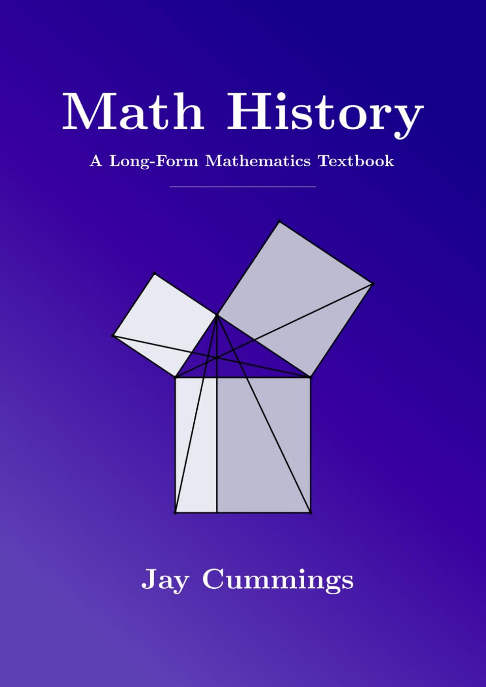

# Math History: A Long-Form Mathematics Textbook

- `Author`: Jay Cummings
- `Year`: 2025



> 주의: 요약과 문장 번역을 제 마음대로 하기 때문에 부정확할 수 있습니다.

재치있고 깊이 있는 수학 교과서로 유명한 저자가 수학사 책을 만드셨다고 해서 살 수밖에 없었다. 책이 엄청 엄청 크다. 구조가 정말 잘 짜여져 있었고, 전체적으로 가볍고 장난기 있는 문체가 좋았다. (근데 수학 입문자는 이해 못할 농담이 많다) 재미있는 탐구 문제나 특이한 일화도 나오는데 요약하다가 그게 다 사라져서 아쉽다.

> 책을 읽고 나서 한 번 유명한 수학자들을 짧은 평으로 정리해 봤는데 그게 제일 재밌었다. 맨 아래 [F. 수학 위인전](#f-biographical-sketches-수학-위인전)에 적었으니 수학사 관심 없으면 그것만 봐도 된다.

## 1. Number Systems 수의 체계

### 사람들이 처음으로 수학을 한 건 언제일까? 

**[43,000년 전]** 남아공 "Lebombo 뼈"에 칼집이 일정하게 새겨져 있지만 수를 센 흔적인지는 확실하지 않다.

**[20,000년 전]** 콩고 "Ishango 뼈"에는 칼집이 몇 그룹으로 나눠져서 새겨져 있는데, 그 중 일부 그룹의 칼집 개수 합이 똑같아서, 뭔가 계산을 한 흔적이 아닌가 예상된다.

### 수를 센다는 건 무엇일까?

아주 적은 개수의 물체는 그냥 딱 보면 몇 개인지 알 수가 있다(subitizing). 하지만 개수가 많아지면 일정 개수를 하나로 묶어서 단위화해서(unitizing) 셀 필요가 있다. 그렇게 하면 **수의 체계**(number system)가 나오게 된다.

우리가 쓰는 십진법이라는 체계는 **자리가 있는 수의 체계**(positional number system)이다. 역사적으로는 파푸아뉴기니의 사진법(quaternary), 마야나 아즈텍의 이십진법(vigesimal), 바빌로니아의 육십진법(sexagesimal)도 존재했다.

그 외에도 수의 체계는 다양하다. 한자로 쓰는 숫자는 **곱셈을 이용한 그룹화**(multiplicative grouping)에 해당하는데, "123"처럼 숫자만 쓰는 게 아니라 "一百二十三"처럼 자리의 크기를 함께 써서 `1 * 100 + 2 * 10 + 3`라는 곱셈을 직접 표현한다.

더 **간단한 그룹화**(simple grouping)로는 이집트 상형문자나 로마 숫자가 있다. 1, 10, 100에 해당하는 기호만 있고 "CXXIII"처럼 기호를 여러 번 써서 수를 표현한다.

좀 더 **암호 같은 체계**(ciphered system)도 있다. 그리스 이오니아에서는 1, 2, 3...을 나타내는 기호와 10, 20, 30...을 나타내는 기호 등이 전부 따로 있었다.

### 가장 좋은 진법은 무엇일까?

똑같은 수를 나타낼 때 쓰는 기호의 종류가 적을수록 좋다. 그리고 적어야 하는 글자의 개수가 적을수록 좋다. 이 2가지는 상보적인 관계라 다 만족시킬 수는 없지만, 십진법 정도면 밸런스는 괜찮다. 하지만 이보다 좋은 것도 있는데:

- **십이진법**: 12는 약수가 많다. 십이진법에서는 주어진 분수를 소수(小數)로 바꾸기가 간편하다.
- **십일진법**: 11은 소수(素數)다. 십일진법에서는 주어진 소수(小數)를 분수로 바꾸기가 간편하다.

### 0의 발견

마야와 인도에서 발견한 듯하다. 인도가 널리 퍼뜨렸다. 고대 그리스에서도 탐구되었지만 수학적인 의미보다는 철학적인 의미였던 것 같다.

### 계산기의 역사

**[BCE 2000]** 현존하는 가장 오래된 '곱셈표'가 바빌로니아에서 쓰였다.

**[BCE 300]** 현존하는 가장 오래된 10진법 곱셈표가 중국 칭화에서 쓰였다. 0에서 100까지 0.5 단위로 나뉘어진 수들 중 임의의 수 2개를 곱한 결과가 뭔지 알려주는 표다. 

주판은 전세계에서 발견된다. 여러 문화권에서 독립적으로 발명했을 수 있다. 그 외 비슷한 도구로는 로마에서 발견된 Counting board, 잉카에서 발견된 Quipu가 있다.

근대로 와서는, Pascal이 사칙연산을 할 수 있는 장치인 Pascaline을 발명했다. John Napier는 Napier's bones와 로그표 등을 발명했다. Charles Babbage는 컴퓨터의 전신이 되는 Analytical engine을 설계했고(제작은 안 함), Ada Lovelace는 그것을 보고 최초로 프로그래밍을 활용해 계산을 하는 방법을 발견했다.

### 순수 수학

중국의 역경에는 마방진이 나온다. 이는 회계나 측량을 위한 수학이 아닌, 순전히 숫자들 사이 관계 그 자체를 탐구하기 위한 "순수 수학"이 존재했음을 보여준다.


## 2. Ancient Methods 고대의 계산법

### 이집트

**[BCE 1650]** 이집트의 Rhind Papyrus에는 다양한 수학적 테크닉이 나오는데, 그에 대한 증명은 없다. 예시로, 길이 12짜리 밧줄로 변 길이 3, 4, 5인 삼각형을 만들어 직각을 만드는 방법이 있다. 또한 곱셈을 할 때 **duplation and mediation**이라는, 한쪽 수는 반으로 나누고 반대쪽 수는 2배로 하면서 더하는 테크닉을 썼는데, 요즘도 컴퓨터공학과 다니다 보면 배운다.

```python
def duplation_and_mediation(a, b):
    result = 0
    while a > 0:
        if a & 1: result += b
        a >>= 1
        b <<= 1
    return result
```

이집트에서는 특이하게 모든 분수를 서로 다른 단위분수(unit fraction, 분자가 1인 분수)의 합으로 나타냈다. 이 방식은 사칙연산의 어려움에도 불구하고 중세까지도 사용되었다. 다만 하나의 분수를 이렇게 나타낼 수 있는 방법도 여러가지인데,

- 그리디 알고리즘으로 매번 가장 큰 단위분수를 빼가며 합 나타내기: 이 방식이 통한다는 건 보장되지만(Fibonacci), 분모의 숫자가 매우 커질 수 있다.
- 따라서 `2/3n = 1/2n + 1/6n` 등 다양한 공식이 개발되었다.

```python
# numer/denom을 단위분수 (1/a1 + 1/a2 + ...) 의 합으로 나타낸다
def egyptian_fraction_greedy(numer, denom):
    while numer != 0:
        # numer/denom을 넘지 않는 최대 단위분수 1/a를 구한다
        # a는 denom/numer 이상의 최소 정수
        a = denom // numer
        if denom % numer != 0:
            a += 1
        print(f'1/{a}')
        # 새로운 분수 numer/denom - 1/a를 구한다
        (numer, denom) = (numer * a - denom, denom * a)
```

### 바빌로니아

**[BCE 1800]** 바빌로니아의 Plimpton 322 판에는 피타고라스 삼조(Pythagorean triple, `a^2 + b^2 = c^2`을 만족시키는 세 수 `a, b, c`를 뜻함)가 다수 등장한다. 직각삼각형마다 `(빗변^2)/(높이^2)`를 계산해 표로 만든 것이다.

**[BCE 1700]** 바빌로니아의 YBC 7289 판에는 루트 2에 대한 매우 정확한 근사(305470/216000)가 나와있는데, 이를 계산한 방식은 알려져 있지 않다. 재귀적으로 예측값의 평균을 구하는 Hero's method를 활용했을 것으로 추측된다. 이 방법은 매우 효율적이기 때문에 현대 컴퓨터에서도 사용된다.

```python
def heros_formula_sqrt2(initial = 1, repeat = 5):
    a = initial
    for _ in range(repeat):
        a = (a + 2/a) / 2
        print(a)
```

### 중국

**[BCE 200]** 중국의 산수서(算數書)에 현존 가장 오래된 연립일차방정식이 나온다. 또한 일차방정식 `f(x)=0`의 해를 알아낼 때 함숫값을 두 번 체크한 뒤 그 결과를 이용하는 double false position 테크닉이 나온다.

```python
def f(x): # 임의의 1차 함수
    return 123*x - 456

def double_false_position(f, x1, x2): # x1과 x2에는 아무 숫자나 넣어도 됨
    b1 = f(x1)
    b2 = f(x2)
    return (b1*x2 - b2*x1) / (b1 - b2) # f(x) = 0의 해
```

**[BCE 10c ~ 2c]** 중국의 구장산술(九章算術)에 음수가 등장한다. 또한 다변수 선형 시스템과 가우스 소거법이 나오는데 이를 방정(方程)이라 했다.

### 방위의 계산

- 로마의 Vitruvius를 포함해 다양한 문화권에서 그림자를 이용해 동서남북을 파악하는 방법을 사용했다. 방위 파악 기술은 기자 피라미드에도 사용되었고, 아메리카의 Puebloan들도 사용한 것으로 보인다.
- 이슬람교에서는 메카가 있는 방향을 qibla라고 하는데, 이를 정확히 계산하기 위해 기하학이 발달했고 아스트롤라베 등의 기구도 생겨났다. al-Battānī는 삼각법으로 메카가 있는 방향을 구하는 방법을 정립했고, al-Nayrizi는 보다 정확한 구면기하를 도입했다.
- **[BCE 1300]** 폴리네시아에서는 뉴질랜드, 하와이, 이스터 섬 사이 수천 킬로미터의 바다를 항해했다. 이때 사용한 기술은 etak system이라고 예상된다. 출발지와 도착지를 잇는 선 바깥에 있는 세 번째 가상의 지점을 etak이라 하고 그 etak의 방향에 따라 현재 위치를 알아내는 것이다.

## 3. Transition to Proofs 증명의 등장

**[BCE 600]** Thales of Miletus는 현존 가장 오래된 수학 증명을 남겼다. "지름은 원을 같은 두 부분으로 나눈다"를 포함한 5개의 정리를 증명했다.

**[BCE 600 - 500]** Pythagoras는 Samos 출생으로, 그가 Crotona에 세운 피타고라스학파에서는 Quadrivium(산수, 기하, 음악, 천문)을 가르쳤다. 다만 Pythagoras와 관련된 설 대부분의 신빙성은 낮다.

피타고라스의 정리는 다양한 문화권에서 발견되었다. 그리고 그 의미는 적어도 1900년대 초까지는 `a^2 + b^2 = c^2`라는 수식이 아닌, 기하적인 의미였다. "직각삼각형에서 빗변을 한 변으로 하는 정사각형의 넓이는 나머지 두 변을 각각 한 변으로 하는 정사각형 두 개의 넓이 합과 같다"

**[BCE 1500 - 500]** 힌두교 경전 베다의 부록에는 제단을 기하학적으로 만드는 방법이 담긴 Śulbasūtra가 있다. 피타고라스 정리 등도 나오지만 증명은 없다. 원과 같은 넓이의 사각형을 (근사해서) 그리는 방법도 나온다.

Euclid는 원시 피타고라스 삼조(primitive Pythagorean triple, 피타고라스 삼조면서 최대공약수가 1인 세 수)를 찾는 방법을 만들고 증명했다. `m`과 `n`이 서로소이고 그 중 하나는 짝수라면, `m^2 - n^2, 2mn, m^2 + n^2`는 직각삼각형의 세 변 길이가 된다.

**[7c]** 인도 Brahmagupta는 세 변이 유리수인 모든 직각삼각형을 찾는 방법을 만들었다. 세 변의 길이가 `a, b, c`라면 `a = (u^2 + v^2)/v`, `b = (u^2 + w^2)/w`, `c = (u^2 - v^2)/v + (u^2 - w^2)/w`인 유리수 `u, v, w`가 존재한다.

### 작도 문제의 발전

**[1837]** Pierre Wantzel은 컴퍼스와 눈금 없는 자를 가지고는 대수적 수(algebraic number)만 만들 수 있다는 것을 발견했다.

**[1748]** Euler가 `e^(i*pi) = -1`을 발견한다. **[1773]** Charles Hermite가 `e`는 초월수라는 것을 발견한다. **[1882]** Ferdinand von Lindemann은 여기에 더해 `b`가 대수적 수라면 `e^b`는 초월수라는 것, 즉 `pi`도 초월수라는 것을 발견한다. 이로써 3대 작도 불능 문제 중 주어진 원과 같은 넓이의 사각형을 그리는 것은 불가능하다는 것이 증명된다.

### 기하학의 출발점?

기하학은 측량과 세금의 문제에서 출발했을까? 나일 강 범람 문제를 해결하던 이집트로부터 발전한 기하학이 그리스로 전파됐을 수 있다. 로마 Marcus Junius Nipsius는 강을 건너지 않고 강 너비를 측정하기 위해 합동 삼각형을 활용하기도 했다.

## 4. Euclidean Geometry 유클리드 기하학

**[BCE 300]** Euclid가 원론(Elements)을 출판한다. 이것이 얼마나 대단한 업적인지는 직접 책을 참고.

### 원론의 구성

- 23개의 정의(Definition)

점, 선, 직각, 원 등 용어의 정의가 나와 있다. 원론에서 '선'은 직선과 곡선을 모두 의미한다. '평행'의 정의는 마지막에 나온다.

- 5개의 공준(Postulate)

`주어진 한 점에서 주어진 다른 한 점으로 언제나 직선을 그을 수 있다` 등이 나온다. 역시 평행선 공준은 맨 마지막에 나온다.

- 5개의 공리(Common notion)

`a = b, b = c이면 a = c이다` 등이 나온다. 참고로 현대 수학에서 공리는 Axiom이라고 해서 좀 다른 용어를 쓴다.

- 465개의 명제

13권에 걸쳐 증명된다.

### 원론 1권 내용 맛보기

| 명제 | 내용 |
| -: | :- |
| 1 | 정삼각형 작도 |
| 2, 3 | 작도 시 길이 옮기기 |
| 4 | SAS 합동 |
| 5, 6 | 이등변삼각형은 두 각 동일 (※ 귀류법 사용) |
| 9 | 각 이등분선 작도 |
| 10 | 선분 수직이등분선 작도 |
| 11, 12 | 수선의 발 작도 |
| 13, 14 | 직선이면 180도 |
| 15 | 맞꼭지각은 크기 같음 (※ Thales가 증명함) |
| 16 | Exterior angle theorem (삼각형의 한 외각은 다른 두 꼭짓점들의 내각들보다 크다) |
| 26 | AAS 합동 (※ 명제 16과 귀류법 사용) |
| 27, 29 | 엇각 동일하면 평행 (※평행 개념의 사용은 여기까지 최대한 미뤄졌음) |
| 31 | 평행선 작도 |
| 32 | 삼각형 내각 합 180도 |
| 41 | 평행사변형 넓이는 삼각형 넓이의 2배 |
| 46 | 정사각형 작도 |
| 47 | 피타고라스 정리 |

### 작도 문제의 발전 2

**[1801]** Gauss: n이 `2의 거듭제곱 * 서로 다른 페르마 소수들의 곱` 형태라면 n각형은 작도 가능하다. (페르마 소수: 2^n + 1 형태의 소수)

**[1837]** Wantzel: 위 명제의 역을 증명했다.

### 공리의 변천

**[19c]** 유클리드 5번 공준(평행선 공준)은 1 - 4번 공준에서 도출되지 않는다. 5번 공준을 바꾸면 비유클리드 기하학, 곧 구면 기하학(spherical geometry)과 쌍곡 기하학(hyperbolic geometry)이 생겨난다.

David Hilbert는 원론을 개정하며 Euclid가 정확히 명시하지 않은 공리들을 다듬어 공리를 20개로 정리했다.

### Euclid 외에 옛날 기하학

**[BCE 3c]** Apollonius of Perga: 원뿔곡선, 아폴로니우스 문제(주어진 세 원에 접하는 원 찾기) 발견

Śulbasūtra에는 루트2에 대한 근사 `1 + 1/3 + 1/(3*4)`가 있는데, 기하적으로 구했을 것으로 예상된다.

### 기하학과 예술

**[15c]** Filippo Brunelleschi 등은 원근법을 연구하며 기하학과 예술을 접목시켰다.

Da Vinci는 구 모양 캔버스에 대한 아이디어를 냈는데, 이는 **[17c]** Girard Desargues의 사영기하학(projective geometry)의 기초가 되었다.

**[1715]** Brook Taylor의 논문 Linear perspective에서 소실점 등에 관한 탐구가 심화되었다.

**[19c]** Jean-Victor Poncelet는 현대적인 사영기하학을 재발견했다. 이에 영향을 받은 Felix Klein은 비유클리드 기하의 연구에 대한 Erlangen program을 제안했다.

**[20c]** L.E.J. Brouwer도 Poncelet의 영향을 받아 다양하게 변형된 표면에 대한 사영을 연구했고, 이는 초기 위상수학에 중요한 연구가 되었다.

## 5. Number Theory 수론

### 유리수

피타고라스 학파는 어떤 두 수 a, b든지, 그 둘을 잴 수 있는 하나의 단위 c가 있어 `a = nc, b = mc`로(n, m은 자연수) 나타낼 수 있다고 믿었다(commensurable). 다르게 말하면 어떤 두 수든 정수의 비로 나타낼 수 있다는 것이다.

그러나 피타고라스 학파의 Hippasus는 루트2가 무리수임을 증명했다. 즉, 예를 들어 1과 루트2는 commensurable하지 않다. 어떻게 증명했는지는 전해지지 않지만, 수식적으로든 기하적으로든 귀류법을 썼을 것으로 예상된다.

### 완전수

Euclid: `2^n - 1`이 소수면 `2^(n-1)(2^n - 1)`은 완전수이다. (※ `2^n - 1`이 소수면 그것을 Mersenne 소수라 한다.)

Euler: 모든 짝수 완전수는 `2^(n-1)(2^n - 1)` 형태이고 이때 `2^n - 1`은 소수다.

Fermat:
- n이 합성수면 `2^n - 1`은 합성수이다.
- p가 소수면 `2p | 2^p - 2`
- p, q가 소수고 `q | 2^p - 1`이면 어떤 정수 `k`에 대해 `q = 2kp + 1`
- 페르마의 소정리(Fermat's little theorem): p 소수고 p가 a의 약수가 아니면 `p | a^(p-1) - 1`
- 이는 추후 Euler's theorem으로 일반화되고, 현재 RSA 암호체계 등에 활용된다.

### 소수

Euclid: 모든 합성수는 어떤 소수로 나눠진다. 소수의 개수는 무한하다.

Christian Goldbach: (추측) 2보다 큰 모든 짝수는 두 소수의 합이다.

Alphonse de Polignac: (추측) 쌍둥이 소수(두 소수가 2 차이나는 경우)의 개수는 무한하다.

소수 정리(Prime number theorem): n 이하의 소수의 개수 `pi(n)`은 함수 `n/log(n)`과 같은 속도로 커진다. (Jacques Hadamard & Charles Jean de la Vallée Poussin)

_자세한 이야기는 생략_

### 나머지

손자: 중국인의 나머지 정리(Chinese remainder theorem)

_생략_

Gauss: modulo 연산

### 페르마의 마지막 정리(Fermat's last theorem, FLT)

`x^n + y^n = z^n`을 만족시키는 자연수 `x, y, z`, 2보다 큰 자연수 `n`은 존재하지 않는다.

Fermat: n = 4인 경우 증명

Euler: n = 3인 경우 증명(다만 주요 단계 하나 빼먹음)

Sophie Germain: 소수 지수에 대해서만 증명해도 된다는 것 발견
- Sophie Germain's theorem: 소수 p에 대해 `x^p + y^p = z^p`라고 하자. `2Np + 1`이 소수고, `1^p, 2^p, ..., (2Np)^p`를 `(2Np + 1)`로 나눈 나머지들 중 인접한 수가 없다면, `x, y, z` 중 하나는 `2Np + 1`로 나눠떨어진다.
- FLT를 **Case I** (`x, y, z`가 모두 `p`와 서로소인 경우에 해 없음 증명)와 **Case II** (`x, y, z` 중 `p`의 배수 적어도 하나 있는 경우에 해 없음 증명)로 나눴다.
- Legendre와 함께 197 이하의 소수에 대해 FLT Case I 증명

**[1823]** Legendre: p = 5인 경우 증명

**[1839]** Gabriel Lame: p = 7인 경우 증명

**[1995]** Andrew Wiles: 페르마의 마지막 정리 증명

_생략_

## 6. Algebra 대수학

### 1차, 2차 방정식

**[9c]** Al-Khwārizmī: 1차, 2차 방정식을 풀었다. 완전제곱식으로 만드는 기하적 풀이를 사용했다(completing the square).

### 3차, 4차 방정식

**[11c]** 페르시아의 Omar Khayyam: 원뿔곡선의 교점을 이용해 특수한 경우의 3차 방정식을 푸는 법을 발견했다.

**[1494]** 이탈리아의 Luca Pacioli: 저서 Summa de Arithmetica에서 초창기의 변수 표기를 도입했다. 3차 방정식을 푸는 공식을 찾아주기를 수학계에 요청했다.

Scipione del Ferro: 압축 3차 방정식(Depressed cubic) `x^3 + mx = n`을 풀었다.

Tartaglia: 압축 3차 방정식 `x^3 + mx^2 = n`을 풀었다.

Gerolamo Cardano: 일반적인 3차 방정식을 풀었다고 알려져 있다. 사실 여기에는 엄청난 스토리가 있는데...

이 당시에는 두 수학자가 각자 상대에게 문제를 내 풀게 하는 "수학 대결"이 유행했는데, 그래서 수학자들은 자기가 발견한 수학적 지식을 자기만 알려고 하기도 했다. 위의 del Ferro는 자신이 발견한 풀이를 비밀로 하다 죽기 전 제자 Antonio Fior에게 알렸다. Fior는 Tartaglia에게 수학 대결을 신청하고 del Ferro의 압축 3차 방정식 문제만 30개를 냈다. 푸는 과정에서 Tartaglia도 압축 3차 방정식의 풀이를 발견하게 되었는데 그 역시도 이를 비밀에 부쳤다.

Cardano는 Tartaglia에게 풀이를 알려달라 했다가 여러 번 거절당한 끝에, 결국 발설하지 않는다는 계약 하에 시의 형태로 전수받았다. Cardano는 자기 동료 Lodovico Ferrari에게만 풀이를 알려주었고, 함께 3차 방정식의 일반해, 그리고 4차 방정식의 일반해를 알아냈다. 하지만 거기에는 Tartaglia의 풀이가 포함되어 있어 계약에 따라 일반해를 공표할 수 없었다. 그러다 Cardano는 예전에 del Ferro가 Tartaglia와는 독립적으로 같은 풀이를 발견했었다는 사실을 알게 됐다. 이를 근거로 Cardano는 일반해를 저서 Ars Magna에서 공개했다. 이에 반발한 Tartaglia가 Ferrari와 수학 대결을 했다가 지면서 논란은 종식됐다.

### 5차 이상의 방정식

**[1799]** Paolo Ruffini: 5차 방정식의 일반해는 존재하지 않는다고 추측했다.

**[1826]** Niels Abel: 처음에는 5차 방정식의 풀이를 찾았다고 생각했으나, 곧 실수를 알게 되었다. 몇 달 이후 5차 방정식의 풀이는 존재하지 않음을 증명했는데 당시 나이 겨우 21세. 그러나 이 결과는 그의 논문을 검토한 Cauchy와 Legendre가 제대로 확인하지 않은 탓에 학계에 잘 알려지지 않았다. Abel은 1829년 사망했다.

**[1829]** Évariste Galois: Abel과 독립적으로, 역시 5차 방정식의 풀이를 찾았다 생각했다가 실수를 알게 된 끝에, 5차 방정식의 풀이는 존재하지 않음을 증명했다. 나아가 방정식이 언제 radical로 된 근을 가지는지 알 수 있는 기준을 탐구하며, 군론(group theory)와 갈루아 이론(Galois theory)의 기초를 닦았다. 당시 나이 겨우 18세. 그러나 이 결과 역시 학계에 빠르게 알려지지 않았다. Galois는 만 20세에 결투에서 죽음을 맞이했다.

이후 Arthur Cayley 등을 거쳐 Walther von Dyck가 군을 현대적으로 정의했다.
- **군**: "닫 결 항 역" (집합이 어떤 연산에 대해 닫혀 있고, 결합 법칙이 성립하고, 항등원과 역원이 존재)
- **아벨군**: 교환법칙도 성립하는 군

### 대수학의 기본 정리(Fundamental Theorem of Algebra)

계수가 복소수인 n차 함수는 (중근은 중복해서 셌을 때) 복소수 근을 n개 가진다는 정리이다.

Euler와 Gauss 등 여러 사람이 증명을 시도했지만 수학적으로 엄밀하지 않았다. Gauss의 첫 증명은 Jordan Curve Theorem을 증명 없이 사용한 것만 빼면 문제가 없었다. Gauss는 그의 생애에 걸쳐 총 4가지 방법으로 증명을 시도했는데, 그 중 2가지는 타당한 증명이었다.

**[1806]** Jean-Robert Argand가 처음으로 엄밀한 증명을 성공한다. 복소수를 기하적으로 해석해, 예를 들어 `i`를 곱하는 것을 복소평면에서의 90도 회전으로 보았다. 이 이후 복소수에 대한 수학자들의 인식이 달라지게 되었다. 증명은 대략 다음과 같다.
- 도움정리
  - (1) 모든 복소 다항함수 `f(x)`는 복소수 전체의 집합에서 연속이다.
  - (2) 복소수 집합 K가 옹골(compact)이면, 정의역이 K이고 함숫값이 실수인 모든 연속함수 `f`는 K에서 최솟값을 가진다.
  - (3) 임의의 복소수 c와 2 이상의 자연수 k에 대해, c의 k제곱근 `c^(1/k)`가 존재한다.
- Cauchy's minimum theorem: 임의의 복소 다항함수 `f(x)`에 대해 `|f(x)|`는 최솟값을 가진다.
- Argand's inequality: 상수함수가 아닌 복소 다항함수 `f`와, `f(c) != 0`인 임의의 복소수 `c`에 대해, `|f(c')| < |f(c)|`인 복소수 `c'`이 존재한다.
- 따라서 `|f(x)|`의 최솟값은 양수일 수 없으므로, 0이어야 한다.
- 따라서 모든 n차 다항함수 `f`는 근을 적어도 1개 가진다. 근을 `c`라 할 때, `f(x) / (x - c)`는 (n-1)차 다항함수가 되므로, 수학적 귀납법을 사용하면 n차 다항함수는 근을 n개 갖게 된다.

William Rowan Hamilton: 복소수를 더 확장해 사원수를 발견했다. `i^2 = j^2 = k^2 = ijk = -1`

### 추상대수학 Abstract algebra

공리를 정하고, 그로부터 만들어진 구조를 보고, 거기에서 흥미로운 정리들을 찾아내려 하는 학문이다. 대표적인 구조로는 벡터공간, 환 등이 있다.

**[1920s]** Stefan Banach: 벡터공간의 공리를 정립했다.

**[1920s]** Emmy Noether: 환 이론(ring theory)을 정립했고, 공리와 구체적인 구조를 분리해 생각했다.

**[1940s]** Samuel Eilenberg, Saunders Mac Lane 등: 추상화의 기조를 Category theory로 발전시켰다.

**[1952]** Nobuo Yoneda: Cayley's theorem을 일반화하여 Category theory의 주요 업적 중 하나인 Yoneda Lemma를 발견했다.

_자세한 이야기는 생략_

### 해석기하학 Analytic geometry

대수학과 기하학을 연결한 학문이다. 선구자로는 René Descartes, Pierre de Fermat가 있다.

Alexander Grothendieck: 현대에 더욱 발전된 대수기하학(Algebraic geometry) 분야의 주요 업적을 남겼다.

_자세한 이야기는 생략_

### 대수학과 예술

대수학에서 다루는 군론은 대칭성과 밀접한 연관이 있다.

Maurits Cornellis Escher: 대칭성을 여러가지 예술적인 방식으로 해석하여 그림에 접목시켰다.

이슬람 건축에서 발견되는 girih 문양은 영원히 반복되지 않는 aperiodic tiling의 일종이다. 두 가지 종류의 타일로 만든 Penrose tiling과 유사하다.

**[2023]** David Smith: 한 종류의 타일로도 aperiodic tiling을 만들 수 있다는 것을 발견했다.

_자세한 이야기는 생략_

## 7. Early Calculus 초기 미적분학

### 초기 적분

**[BCE 5c?]** Zeno of Elea: 제논의 역설

**[BCE 3c]** Archimedes: 곡선 아래 넓이를 미적분의 도움 없이 기하적으로 증명했다. 본인의 가장 위대한 증명이라고 여긴 것은 `원뿔 : 구 : 원기둥`의 부피가 `1 : 2 : 3`이라는 것이었는데, 증명하는 데에 Mechanical method를 사용했다. 또한 Antiphon과 Euclid 등이 발견했던 소진법(method of exhaustion)을 응용했다. 원의 넓이가 `pi * r^2`임을 밝혔는데, 극한을 사용하지 않고 귀류법을 사용했다. 아르키메데스 성질(Archimedean property)도 대수학과 미적분학에 중요한 개념이 되었다.

**[3c]** 중국의 Liu Hui도 method of exhaustion을 활용해 원의 넓이를 계산했다.

### 초기 미분

Descartes, Fermat: 각자 독립적인 방법으로 다항함수의 접선을 찾는 법을 만들었다.

### 급수

Madhava of Sangamagrama: 남 인도에 Kerala 학교를 설립했고, 삼각함수와 급수 등을 가르쳤다.
- 수학적 귀납법으로 `1^k + 2^k + ... + n^k = n^(k+1) / (k+1)`을 증명했다.
- 유한 / 무한 등비급수의 합 공식을 발견했다.
- 지금은 Leibniz formula라고 알려진 `1 - 1/3 + 1/5 - 1/7 + 1/9 - ... = pi / 4`를 Leibniz보다 3세기 이르게 증명했다.
- 사인 함수와 코사인 함수에 대한 Taylor 급수를 발견했다.

Bhāskara II: 달의 순간적인 운동에 대해 연구했다. x와 y가 유사하면 `(sin y - sin x) / (y - x)`가 `cos y`와 유사하다는 것을 밝혔다. 이는 사인함수의 도함수가 코사인함수라는 것과 같다. 현재 롤의 정리(Rolle's theorem)로 알려진 아이디어 등 여러가지 미적분학의 개념을 사용했다.

### 적분

**[17c]** Bonaventura Cavalieri: 두 평면도형이 모든 높이에서 가로 길이가 같다면 그 면적이 같다는 Cavalieri의 원리를 발견했다. 이를 이용해 1차 ~ 9차 다항함수의 정적분을 계산했는데, 치환적분을 활용했다.

_자세한 이야기는 생략_

## 8. Modern Analysis 현대 해석학

### 미적분의 통합

**[16c]** Galilei와 Kepler 등은 움직이는 물체들의 궤적을 연구했다. Tycho Brahe의 관측 데이터를 가지고 Kepler는 행성 운동에 관한 3가지 법칙을 발견했다.

Newton: Leibniz보다 먼저 미분을 연구했지만 비밀로 했다. Principia를 출판했다.
- "흐르는 양"의 개념을 사용했다. 어떤 물체의 위치를 fluent라 하면, 그 속도를 fluxion이라 했다.
- 시간에 대해 미분한 함수는 변수 위에 점을 찍어 나타냈다.
- 물리학의 직관을 바탕으로 무한소(infinitesimal)란 개념을 활용했는데 현대의 극한의 개념과는 차이가 있다. George Berkeley 등은 논리적인 개념이 아니라고 비판했다.
- 무한소 시간을 `o`라고 하고, 물체의 순간적인 이동은 `(x, f(x))`에서 `(x + ẋo, f(x + ẋo))`로 가는 것으로 생각했다.
- Power rule: 유리수 r에 대해 `y = x^r`이면 `ẏ/ẋ = rx^(r-1)`임을 밝혔다.

Leibniz: Newton보다 먼저 미분 연구를 출판했다.
- Differential을 다양한 문제에 활용할 가능성을 발견했다.
- 곱의 미분(Product rule)을 발견했다.

정적분의 개념에서 미적분학 기본정리가 도출되며 미분과 적분이 통합되었다. 이에 대한 첫 증명은 **[1668]** James Gregory가 했지만, 적극적으로 물리학에도 활용한 것은 Newton이었다.

l'Hôpital: Johann Bernoulli의 가르침을 바탕으로 미분에 대한 교과서를 출판했다.

Maria Gaetana Agnesi: 미적분학, 대수학, 기하학 등을 처음으로 종합해 교과서로 출판했다.

Cauchy: 엡실론-델타 논법으로 극한의 개념을 정립했다. 이로써 Newton의 Principia 출판 이후 거의 100년이 지난 시점에 미적분학이 수학적으로 엄밀화되었다.

### 급수

Leibniz, Huygens: `1 / k(k+1)`의 합은 1이다.

Nicole Oresme, Johann Bernoulli: `1 / k`의 합은 발산한다.

Basel problem: `1 / k^2`의 합을 구하는 문제. **[18c]** Euler가 답이 `pi^2 / 6`임을 증명했다. 또한 `1 / k^p`의 합을 26 이하의 짝수 `p`에 대해 계산했다. (`p`가 홀수일 때는 현재도 알려지지 않았다) 그 결과를 응용해 Wallis product `2/pi = 1/2 * 3/2 * 3/4 * 5/4 * 5/6 * 7/6 * ...` 등을 증명했다.

Srinivasa Ramanujan: 말도 안 되는 급수를 무더기로 발견했다.

### 무한

**[19c]** Georg Cantor: 무한의 개념을 정립했다. 두 집합 사이 일대일 대응이 존재하는지 여부를 갖고 집합의 크기를 판단했다. 자연수 전체의 집합의 크기를 Aleph-null이라 했다. 대각선 논법을 통해 실수 전체의 집합은 자연수 전체의 집합보다 크다는 것을 밝혔고, 모든 집합 A에 대해 A의 멱집합은 A보다 크다는 것을 밝혔다.

_자세한 이야기는 생략_

## 9. Topology 위상수학

### 도형의 성질

5종류의 정다면체(Platonic solid)의 연구는 Euclid 원론의 마지막 책에도 나온다. 그러나 Euler 때까지 그 누구도 다면체의 '변'의 개념에 집중하지 않았다.

Euler's Characteristic: 도형의 꼭짓점의 개수를 V, 변의 개수를 E, 면의 개수를 F라 할 때 `V - E + F`를 의미하고 `chi`로 나타낸다.

Euler's Formula: 모든 볼록 다면체에 대해 `V - E + F = 2`이다.

이에 대한 Euler의 증명은, 각 점 근처를 잘라내어 정사면체가 될 때까지 반복하는 형태였다. 그러나 자르는 방법이 엄밀하게 정의되어 있지 않았다. Legendre가 처음으로 엄밀한 증명을 해 냈다. 이 책에는 보다 간결한 William Thurston의 증명(method of discharging)이 수록되어 있다.

_자세한 이야기는 생략_

### 도형의 분류

- Genus: 다면체의 구멍의 수로, `g`로 나타낸다. Euler's Formula를 일반화하면 `V - E + F = 2 - 2g`이다.

- Surface: 국소적으로 평평한 2차원 물체를 의미한다. (3차원이면 Solid라고 부른다.) 예를 들어 2-sphere는 Surface, 3-ball는 Solid이다.

- Closed Surface: 옹골(compact)이고 경계(boundary)가 없는 surface를 의미한다. 이것을 분류하는 것이 위상수학의 주요 주제이다. **[1882]** Felix Klein은 closed surface를 만드는 몇 가지 방법을 발견했다.

- Homeomorphic: 연속적인 deformation으로 한 물체를 다른 물체로 변화시킬 수 있는 경우 두 물체를 homeomorphic하다고 말한다.

Riemann: Riemann surface의 개념을 도입하여, surface 위에서 함수를 적용하는 것에 대해 말할 수 있게 되었다.

**[1858]** Möbius: 뫼비우스 띠를 발견했다. 한 면만 갖고 있는 뫼비우스의 띠를 갖고 만든 Klein bottle은 non-orientable하다.

Classification theorem: 물체의 Euler characteristic과 orientability가 closed surface의 종류를 결정한다. 그 종류는 (1) 구 (2) 구에 n개의 handle을 붙인 것 (3) 구에 n개의 crosscap을 붙인 것 중 하나이다.

### Manifold의 분류

n-manifold: 국소적으로(어디서든) n차원 공간인 것.

**[1960s]** n = 3, n = 4인 경우를 제외한 모든 n-manifold의 분류가 완성되었다.

**[1900]** Henri Poincaré: 3-sphere와 같은 homology를 갖고 있으면 3-sphere와 homeomorphic할 것이라 추측했지만 거짓이었다.

**[1904]** 푸앵카레 추측: closed 3-manifold 위의 모든 loop를 연속적으로 점으로 바꿀 수 있다면 3-sphere와 homeomorphic할 것이라 추측했다.

**[1982]** William Thurston: Thurston's geometrization conjecture을 통해 푸앵카레 추측 증명의 중간 단계를 놓았다.

**[2002]** Grigori Perelman: 푸앵카레 추측을 증명했다. 여기에는 Richard Hamilton의 Ricci flow 개념을 활용했다.

### 현대의 위상수학

위상수학은 시간이 지나며 대수적으로 변화했다. Poincaré는 위상수학에 Betti number, fundamental group, Poincaré duality 등 다양한 개념을 소개했다.

**[1920s]** Emmy Noether: 위상수학을 대수적으로 체계화했다. Homology를 abelian group을 이용해 기술했는데, 이것이 현재의 homology group으로 이어졌다. 이 개념은 free part와 torsion part로 이루어져 있다.

**[1940s]** Samuel Eilenberg, Norman Steenrod: Eilenberg-Steenrod 공리로 Homology 이론을 체계화했다.

20세기 위상수학의 발전에 기여한 사람으로는 Brouwer's fixed point theorem 등을 발견한 L.E.J. Brouwer를 꼽을 수 있고, 21세기 현재 위상수학에 크게 기여한 사람으로는 최초의 여성 필즈상 수상자인 Maryam Mirzakhani를 꼽을 수 있다. 한편 현재 대학에서 일반적으로 가르치는 위상수학의 형태인 Point-set topology의 기틀은 Georg Cantor가 세우고 Felix Hausdorff가 발전시켰다.

## 10. Combinatorics 조합론

TODO

## A. Topics in "Applied" Math "응용" 수학

## B. Mathematician Pronunciation Guide 수학자 발음법

이 책 부록엔 이런 것도 있는 게 굉장히 저자의 감이 좋다. 다만 수학자 이름을 한국어로 배웠으면 발음은 적당히 맞는다. 그래서 생략

## C. Mathematical Quotes 수학 인용구

책에 소개된 인용구 중에서도 인상에 남은 것만 적겠다.

> 'Obvious' is the most dangerous word in mathematics. - E. T. Bell

> Everything should be made as simple as possible, but not simpler. - Albert Einstein

> I have had my results for a long time: but I do not yet know how I am to arrive at them. - Carl Friedrich Gauss

> Either mathematics is too big for the human mind or the human mind is more than a machine. - Kurt Gödel

> You are allowed to lie a little, but you must never mislead. - Paul Halmos

> Who would not rather have the fame of Archimedes than that of his conqueror Marcellus? - William Hamilton

> A problem worthy of attack proves its worth by fighting back. - Piet Hein

> One accurate measurement is worth a thousand expert opinions. - Grace Hopper

> Beware of bugs in the above code; I have only proved it correct, not tried it. - Donald Knuth

> Mathematics is the art of giving the same name to different things. - Henri Poincaré

> We often hear that mathematics consists mainly of 'proving theorems.' Is a writer's job mainly that of 'writing sentences?' - Gian-Carlo Rota

> The point of philosophy is to start with something so simple as not to seem worth stating, and to end with something so paradoxical that no one will believe it. - Bertrand Russell

> There's this weird mathematical phenomenon called universality. You get very complicated systems, of atoms or people, but if you look at it at a large-enough scale, order starts emerging. Einstein once said that the most incomprehensible thing about the universe is that it is comprehensible. It is very complicated, but at certain levels, patterns appear again. So there is order -- sometimes -- but there is also chaos. - Terence Tao

> Seek simplicity, and distrust it. - Alfred Whitehead

## D. History of Math Words 수학 용어의 역사

_생략_

## E. History of Math Symbols 수학 기호의 역사

_생략_

## F. Biographical Sketches 수학 위인전

제일 재밌는 부분이다.

---

### Euclid 에우클레이데스(유클리드) (BCE 300?)

| | |
| :- | :- |
| 출생 | 이집트 Alexandria 추정 |
| 주요업적 | "원론" |
| 한줄평 | 그냥 변태임 |

Euclid가 정말 실존했던 개인이며 혼자 "원론"을 집대성했다 치면 정말 미친 인간이다. 도를 넘어선 **꼼꼼함**을 갖고 있을 게 분명하다. 새롭게 발견한 내용이 많아서보다는, 사람들이 대략적으로만 알고 있던 사실들이 왜 정말 맞는지 그 근거를 바닥에서부터 쌓아올려 전부 정리했기 때문이다. 시대를 현격히 앞서간 **논리성과 체계성**으로 수학을 대했기에 그게 가능했다. 그리고 GOAT 증명 중 하나인 **소수의 무한성** 증명을 세상에 남겼다.

"**평행**"에 대한 정의를 맨 마지막으로 미루고, "평행하지 않은 두 선은 무조건 한쪽에서 만난다"는 내용을 마지막 공준으로 넣은 그의 **통찰**이 무엇보다 놀랍다. 향후 2000년 간 수많은 사람들이 굳이 이렇게 쓸 필요가 있는지 의문을 가졌는데, 결국은 Euclid가 옳았다는 게 밝혀졌다. 설마 그 모든 걸 다 예상했던 걸까?

---

### Archimedes 아르키메데스 (BCE 287? - 212)

| | |
| :- | :- |
| 출생 | 이탈리아 Syracuse |
| 주요업적 | 원뿔 : 구 : 원기둥 = 1 : 2 : 3 |
| 한줄평 | 시간여행자일 듯 |

**고대 수학자 GOAT.** 다른 수학자들이 도형이랑 씨름할 시절에 이 사람은 **적분**을 했다. 나머지 세상이 미적분학을 발견해 이 사람을 따라오기까지 2000년이 걸렸다. 그의 저서 두 권은 유실되었다가 1998년에서야 복원되었는데 여기에서 그가 미적분학의 주요 아이디어들을 발견했음이 드러났다. 물리학과 기하학에서도 시대를 앞서간 여러 학문적 성취를 이뤘다.

그의 고향을 침략했던 로마의 장군 Marcellus에 관한 전기에 따르면, Archimedes는 로마군의 뱃머리를 잡고 내리칠 수 있는 갈고리 등 엄청난 전쟁 병기를 만들어 고향을 방어했다. 1년 반의 전쟁 이후, Syracuse에 축제가 있을 때 로마군이 습격했는데, 이때 Marcellus는 Archimedes를 죽이지 말라고 명했다. Archimedes는 수학 문제를 풀던 중 로마 병사를 맞닥뜨렸는데, 병사의 명령을 무시하고 수학 문제에 집중하다가 살해당했다고 한다. "**그 원을 밟지 마라**"라고 말했다는 이야기도 전해진다.

"**유레카**" 전설의 주인공이다. 목욕 중에, 물체를 물에 넣을 때 수면이 상승하는 정도를 보면 물체의 부피를 알아낼 수 있다는 사실을 깨닫고 유레카를 외치며 나체로 거리를 뛰었다 한다.

필즈상 메달에는 그의 얼굴이 그려져 있다.

---

### Fibonacci 피보나치 (1170? - 1250?)

| | |
| :- | :- |
| 출생 | 이탈리아 Pisa (당시 Pisa 공화국) |
| 주요업적 | 피보나치 수열 |
| 한줄평 | 토끼 번식이 좋은 청년 |

이름은 Leonardo이고 성씨는 Bonacci인지 뭔지 확실치 않다. 30살까지 이곳저곳 여행을 다녔는데 이때 **인도-아라비아 수**를 배워서 유럽에 소개했다. **중세 서양 수학자 GOAT**로 꼽히는 사람으로 수론에서 여러 기초적인 정리들을 발견했는데, **피보나치 수열**이 아니었다면 자기 이름이 붙은 유명한 게 없어서 아쉬울 뻔했다. 근데 Fibonacci가 본명이 아니라면 본인은 진짜 아쉬울 수도?

---

### Madhava of Sangamagrama 마드하바 (1340? - 1425?)

| | |
| :- | :- |
| 출생 | 인도 Kerala (당시 Kochin 왕국) |
| 주요업적 | 무한등비급수 |
| 한줄평 | 가장 저평가된 수학자 |

이 책으로 알게 된, 자이 선정 **가장 저평가된 수학자 1위.** 위키백과에 한국어 페이지도 없는데, 무한에 대한 개념, 급수, 미적분학의 엄청난 선구자이다. 몇백 년 후 유럽에서 Taylor, Newton, Leibniz 등이 오랜 기간 발전된 이론을 써서 겨우 증명한 것들을 이 사람은 이론 없을 시절에 그냥 **생으로** 증명했다. 수학 정리를 산스크리트어로 시처럼 지어 설파했는데, 그러면서도 수학적 엄밀함은 놓치지 않았다.

---

### Pierre de Fermat 피에르 드 페르마 (1607 - 1665)

| | |
| :- | :- |
| 출생 | 프랑스 Beaumont-de-Lomagne |
| 주요업적 | 페르마의 소정리 |
| 한줄평 | 투잡 천재 |

**부업이 수학자인 사람들 중 GOAT.** 법대 나와서 변호사가 본업이다. 이름 중간에 "de"도 고위공무직이라서 붙는 명예로운 호칭이다. 낮에 변호사 일 하다가 집에 와서 노트나 편지에다 끄적거린 것들이 수론, 미적분학, 확률론, 해석기하학의 고전이 되었다. 다만 끄적거리다가 증명을 생략한 게 한둘이 아니라서 후대 수학자들을 (특히 **페르마의 마지막 정리**로) 골치아프게 했다. 페쪽이.

Descartes와 같은 시기에 살았는데, 둘이서 같은 발견을 독립적으로 한 적이 몇 번 있다.

---

### Isaac Newton 아이작 뉴턴 (1643 - 1727)

| | |
| :- | :- |
| 출생 | 영국 Woolsthorpe-by-Colsterworth |
| 주요업적 | 미적분 |
| 한줄평 | |

말해 뭐할까? 물리학계의 고트다. 아래 Leibniz와 함께 미적분학의 기틀을 다졌다.

---

### Gottfried Wilhelm Leibniz 고트프리트 빌헬름 라이프니츠 (1646 - 1716)

| | |
| :- | :- |
| 출생 | 독일 Leipzig (당시 신성로마제국) |
| 주요업적 | 미적분 |
| 한줄평 | |

---

### Leonhard Euler 레온하르트 오일러 (1707 - 1783)

| | |
| :- | :- |
| 출생 | 스위스 Basel |
| 주요업적 | 많다 |
| 한줄평 | GOAT |

스위스가 한 건 했다. **그냥 모든 수학자 중 최고 GOAT.** 1911년에 스위스 과학 재단은 이 사람이 평생 이룬 연구를 정리해 출판하는 프로젝트를 시작했다. 근데 그 프로젝트가 지금도 안 끝났다. 분량이 3만 5천 페이지라고 한다. 아무거나 찍어내서 3만 5천 페이지가 나온 거면 모르겠는데, 그것도 아니고 하나하나 수학, 물리학, 천문학의 역사에 길이 남을 발견으로만 그 분량을 다 채웠다.

만 15세에 Basel 대학교를 졸업했다. 만 19세에는 범선에 돛대를 어떻게 달아야 효율적인지 연구하는 국제 과학 경진대회에서 2등을 했는데, 스위스는 내륙에 있고 그는 바다를 본 적이 없었다. 만 34세까지 러시아 St. Petersburg 학회에 있었는데, 그 시기에 거기서 출간한 모든 연구 중 절반이 이 사람 거다. 그러다가 염증으로 인해 오른쪽 눈을 실명하게 되었는데, "**이제 집중을 방해할 게 줄어들겠군**"이라 말했다.

이후에는 독일 Berlin 학회에서 지내며 독일 공주에게 일대일 과외도 했는데, 이때 남긴 편지들도 대중과학 서적으로서 읽어볼 만하다. 그러다가 왼쪽 눈에도 백내장이 생겼고, 수술했지만 거의 실명에 이르렀다. 그런데 그의 수학 연구 속도는 더 빨라졌다. 주위에 서기들을 앉히고 자기 말을 받아적도록 했는데, 그렇게 해서 1년에 수학 논문 50개를 냈다.

부인 Katharina와 아이를 13명 낳았다. 그러나 그 중 10명은 자신보다 일찍 생을 마감했다.

---

### Sophie Germain 소피 제르맹 (1776 - 1831)

| | |
| :- | :- |
| 출생 | 프랑스 Paris |
| 주요업적 | 소피 제르맹의 정리 |
| 한줄평 | 불행 중 다행으로 인정받은 사람 |

청소년기에 프랑스 혁명 때문에 밖에 못 나가고 집순이가 되었는데 수학에 빠졌다. 부모님은 수학 공부를 만류하다가 그의 고집 끝에 결국 응원해주게 되었다. 대학에서는 여성을 받아주지 않았기 때문에, Lagrange 교수의 공개된 강의자료를 보며 공부하고 남자 가명으로 과제를 제출했다. Lagrange가 그 과제의 독창성을 알아보고 직접 만나서 제자로 삼았다.

Legendre와 함께 일하며 페르마의 마지막 정리를 증명하는 초석인 '소피 제르맹의 정리'를 발견했다. Chladni의 실험을 수학적으로 설명할 방법을 찾아내는 수 년에 걸친 경진대회에서 우승했다. 그러나 Gauss 등의 추천에도 불구하고 학위를 수여받지는 못했고, 학계에서 제대로 인정받기까지는 훨씬 오랜 세월이 걸렸다.

---

### Carl Friedrich Gauss 카를 프리드리히 가우스 (1777 - 1855)

| | |
| :- | :- |
| 출생 | 독일 Brunswick |
| 주요업적 | |
| 한줄평 | |

---

### Augustin-Louis Cauchy 오귀스탱 루이 코시 (1789 - 1857)

| | |
| :- | :- |
| 출생 | 프랑스 Paris |
| 주요업적 | |
| 한줄평 | |

---

### Évariste Galois 에바리스트 갈루아 (1811 - 1832)

| | |
| :- | :- |
| 출생 | 프랑스 Bourg-la-Reine |
| 주요업적 | 갈루아 군 |
| 한줄평 | 요절해서 제일 아쉬운 수학자 1위 |

---

### Bernhard Riemann 베른하르트 리만 (1826 - 1866)

| | |
| :- | :- |
| 출생 | 독일 Breselenz (당시 하노버 왕국) |
| 주요업적 | |
| 한줄평 | |

---

### Georg Cantor 게오르크 칸토어 (1845 - 1918)

| | |
| :- | :- |
| 출생 | 러시아 Saint Petersburg |
| 주요업적 | |
| 한줄평 | |

---

### Henri Poincaré 앙리 푸앵카레 (1854 - 1912)

| | |
| :- | :- |
| 출생 | 프랑스 Nancy |
| 주요업적 | 위상수학 |
| 한줄평 | FM |

직업정신이 투철하고 규칙적인 생활을 하는 사람이었다. 자기 연구에 온전히 집중하는 것은 매일 4시간(10 - 12시, 17 - 19시). 그렇게 해서 역사상 가장 생산적인 수학자 중 한 명이 되었다. 하지만 여느 사람이 샤워하다가 갑자기 아이디어가 생각나는 것처럼, 그도 무의식 한켠에 담아둔 수학 문제의 풀이가 어느 순간 갑자기 떠오르는 건 똑같았다고 한다.

---

### David Hilbert 다비트 힐베르트 (1862 - 1943)

| | |
| :- | :- |
| 출생 | 독일 Königsberg? (당시 프로이센 왕국) |
| 주요업적 | 힐베르트 공간 |
| 한줄평 | 건축가 |

현대의 Euclid다. "**원론**"을 현대적인 언어로 재구성하며 수학의 기초를 다시 쌓아 올렸고, 1900년을 맞이해 앞으로 수학계에 중요할 **23개의 미해결 문제**를 제시해서 현대 수학의 방향을 잡는 데도 일조했다. 수학에 있어선 꼼꼼하고 원리 원칙대로 하는 것을 무엇보다 중요시했지만, 완전무결한 수학을 꿈꾸던 그의 **힐베르트 프로그램**은 Gödel의 증명에 의해 좌절되기도 했다.

대학교 은퇴 전 마지막 연설에서 그는 이렇게 남겼다. "Wir müssen wissen. Wir werden wissen." (우리는 알아야만 한다. 우리는 알게 될 것이다.)

---

### Bertrand Russell 버트런드 러셀 (1872 - 1970)

| | |
| :- | :- |
| 출생 | 영국 Trellech |
| 주요업적 | Principia Mathematica |
| 한줄평 | 문이과 통합 인재 |

어릴 적 부모님을 여의고 조부모에 의해 길러졌다. 할아버지는 전 영국 수상이었다. 청소년기부터 확고한 무신론자였으며 종교를 비판했다. 당시 수학의 논리적 허점이었던 러셀의 역설을 발견했고 Whitehead와 함께 "Principia Mathematica"를 출간해 현대 수학의 기초에 크게 이바지했다. 1차 세계대전 때 전쟁에 반대하다가 6개월간 감옥살이를 했다. 2차 세계대전 이후에는 BBC에서 철학 토론 프로그램에 자주 나왔고, 핵무장 해제를 주창했다.

이혼을 3번 했다. 아이는 2번째 와이프와 낳은 자식이 둘, 3번째 와이프와 나은 자식이 하나였다. 4번째 와이프와는 행복하게 살았다고 전해진다.

노벨 문학상을 받았다.

---

### Emmy Noether 에미 뇌터 (1882 - 1935)

| | |
| :- | :- |
| 출생 | 독일 Erlangen |
| 주요업적 | |
| 한줄평 | |

---

### Srinivasa Ramanujan 스리니바사 라마누잔 (1887 - 1920)

| | |
| :- | :- |
| 출생 | 인도 Erode |
| 주요업적 | 사람 머리로 설명이 불가한 수식들 |
| 한줄평 | 우주인 |

역시 요절해서 너무나 아쉬운 수학자. 당대의 수학 천재들도 이 사람에게 벽을 느낄 정도의 어나더였다. 

Namagiri Thayar 여신을 섬기는 힌두교 신자였고, 카스트는 브라만인데(제1계급) 경제적으로는 궁핍한 "브라만푸어"였다. 수학을 좋아하던 그가 만 16세 때 어쩌다 본 것은 "Cambridge대 시험 대비용 수학정리 5000개 암기집"이었다. 그 무엇보다도 주입식 교육을 위해 만들어진 책을 읽으며 그는 누구보다 창의적인 수학자가 되었다.

대학에서 수학 말고 아무것도 안 하다 제적당하고, 5년 간 백수로 집에서 수학만 탐구하며 살다가 부모님이 그렇게 살지 말라고 정략결혼시켰다. 그래도 부인과 교류는 없었고 계속 수학을 했다. 이때 발견한 것들을 간간이 발표할 때만 해도 그가 제대로 된 수학자인지 의심하는 이들이 많았다. 풀이 과정을 엄밀히 적지 않고 불가사의한 결과만 나열하는 식이었기 때문이다.

만 23세에 Cambridge대 G.H. Hardy 교수한테 (누가 봐도 사짜처럼 보이는) 자기소개 편지를 보냈는데, Hardy가 그의 천재성을 알아보면서... 아니 그보다는 인간의 범주를 벗어난 무언가를 맞닥뜨렸다는 걸 깨닫고서 그와 교류를 시작한다. Hardy는 Ramanujan이 보낸 연구 결과에 대해 "이건 참이어야 한다. 왜냐하면 이런 걸 거짓으로 꾸며낼 만한 상상력이 있는 사람은 없기 때문이다."라고 말했다.

Ramanujan은 힌두교의 교리로 인해 바다를 건너 영국에 갈 수 없었지만, 오랜 설득 끝에 가기로 한다. 영국에서 엄밀한 수학적 방법론을 배우고 얼마 간 학문적 성취를 이뤘다. 그러나 사회적으로 소외된 상황에서 1차 세계대전 등 여러 상황이 겹치며 신체적으로도 정신적으로도 고난을 겪는다. 열차 앞에서 자살을 시도했다가 역무원에 의해 저지되었다.

Cambridge에서 학사학위, 그리고 왕립학회 회원(FRS) 직위까지 얻은 뒤 인도로 금의환향했고 부인과도 교류했으나, 건강은 회복되지 않아 1년 뒤 생을 마감했다. 어릴 적에 5년 간 집에서 지내던 시절 그가 노트에 남긴 연구 결과들은 정리되지 않은 채 불가사의로 남게 되었다.

---

### Kurt Gödel 쿠르트 괴델 (1906 - 1978)

| | |
| :- | :- |
| 출생 | 체코 Brünn (당시 오스트리아-헝가리) |
| 주요업적 | 괴델의 불완전성 정리 |
| 한줄평 | 괴델스러웠음 |

수학의 기틀을 세웠기 때문이 아닌, 당시까지 수학의 기틀이라고 믿었던 무언가를 무너뜨렸기 때문에 위대한 논리학자이다. 허무와 모순, 어딘가 직관과 어긋나 있는 연구, 누구보다 괴델스러운 연구를 했다. 현실의 그의 생애는 괴델스럽지 않았다면 좋았으련만, 그러지 못했다. 건강도 좋지 않았고, 당시 정치 상황으로 여러 나라를 옮겨다니며 살아야 했다. 절친 Einstein의 죽음 이후 정신적 문제가 심화된 그는 말년에 극도의 불안과 의심 증세를 보였다. 부인이 몸져누운 후 그는 외부와 단절되려 했고 단식을 하다 아사했다.

Gödel과 Einstein은 생전 매일 함께 걸으며 수학, 물리, 우주에 대해 이야기를 나눴다. 말년의 Einstein은 Gödel과 함께 집에 걸어가며 이야기할 수 있다는 것만으로도 출근할 이유가 된다고 말했다.

---

### Paul Erdős 폴 에르되시 (1913 - 1996)

| | |
| :- | :- |
| 출생 | 헝가리 Budapest (당시 오스트리아-헝가리) |
| 주요업적 | 조합론 |
| 한줄평 | 괴짜 |

쓴 논문이 1500개다. 개수로 따지면 누구보다(Euler보다도) 많다. 반대로 현실에서는 무소유였다. 고정된 직업도 없이 양손에 들 정도의 짐만 가지고 전세계를 돌아다니고, 돈이 생겨도 기부했다. 친구들 중 하나의 집에 들이닥쳐서 며칠동안 수학을 쏟아내고 떠나곤 했다. 각성제를 먹고 하루 19시간씩 수학을 했다. 

수학 강의를 교회 예배라 부르고 수학 학회는 교회 집회라 불렀다. 신은 "The Supreme Fascist", 大파시스트라 불렀다. 그의 말로 大파시스트께서는 가장 완벽한 수학 증명들이 모두 적혀 있는 책 "The Book"을 지니고 있다고 했다. 그래서 그는 올바른 증명을 들어도 The Book에 나올 법한 증명이 아니라면 만족하지 않았다.

다른 수학자들과 활발히 교류했다. 함께 논문을 쓴 사람이 500명이 넘는데, 그래서 수학자마다 논문으로 몇 다리를 건너면 Erdős와 만나게 되는지 알아보는 "Erdős 수"도 생겼다. 또한 흥미로운 수학 난제를 만드는 데에 일가견이 있었다. 난제를 수천 개나 만들고 상금을 조금씩 걸어 놓았는데, 현재도 수학자들이 활발히 하나씩 해결하고 있다.

Erdős가 말년에 이 책 저자의 스승 Ron Graham에게 보낸 한 메시지는 다음과 같다.

> My mother said, "Even you, Paul, can be in only one place at one time." Maybe soon I will be relieved of this disadvantage. Maybe, once I've left, I'll be able to be in many places at the same time. Maybe then I'll be able to collaborate with Archimedes and Euclid.

---

### Terence Tao 테렌스 타오 (1975 -)

| | |
| :- | :- |
| 출생 | 오스트레일리아 Adelaide |
| 주요업적 | 그린-타오 정리 |
| 한줄평 | 마지막 위대한 수학자 |

**현생 수학자 GOAT.** 국제수학올림피아드에서 11살에 동메달, 12살에 은메달, 13살에 금메달. 세 가지 색깔을 다 수집하고 싶었던 걸까? 마치 일차함수처럼 깔끔한 성장. 그런데... 이 성장이 멈추지 않고 계속되고 있다? 2004년에 그린-타오 정리 증명. 2015년에 에르되시 불일치 문제 증명. 2019년에 콜라츠 추측에서 큰 성과. 2025년에도 에르되시 문제를 계속 해결해 나가는 중. 과연 이 사람 어디까지 갈까? 우리 어머니와 연세가 비슷하신데 어머니도 운동 포기하지 말고 꾸준히 해서 이렇게 성장하라고 말씀드리고 싶다.

어느 한 분야가 아닌 "수학 전체"를 깊이 있게 탐구한 학자는 그가 마지막일 것이다.