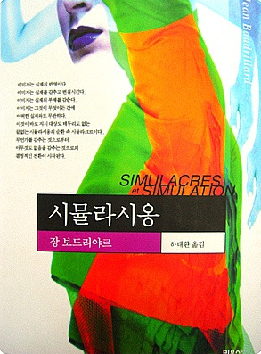

# Simulacres et Simulation

- `Author`: Jean Baudrillard
- `Translator`: 하태환
- `Publisher`: 민음사
- `Year`: 2001 (Original: 1981)

> 주의: 요약을 제 마음대로 하기 때문에 부정확할 수 있습니다.

## 읽기 전

고등학교 때 처음 접했다. 그때까지 살면서 읽은 책 중에 제일 어려웠다. 단어 하나하나 사전을 찾아보며 어머니와 함께 읽었다.

지금 와서 기억이 희미해진 채 그때 끄적인 노트들을 보니까 감회가 새롭다. 지금의 내가 고친다고 더 나은 해석이 될지는 모르겠다. 아니면 이런 철학 책은 원래 정확히 해석한다는 개념이 없는 걸까? 이 책에 대한 리뷰를 검색해봐도 책의 번역이 잘못됐다, 서로의 해석이 잘못됐다면서 토론하는 글이 많다. 그래서 여기서는 책을 감히 해석하려 하기보다는, 당시에 내가 책을 읽으며 이해하고 느꼈던 게 뭔지 정리를 위주로 해 보겠다.

## 대략 감상

장 보드리야르는 현대 사회에 단단히 화가 났다. 어딘가 꼬인 허무함과 냉소가 책에 가득 쌓이다 못해 흘러 넘친다. 현대 사회를 표현하기 위한 다양한 철학적 용어가 책에 나오는데, 그게 논리적으로 이해가 되는 건 체감상 한 반절이었다. 나머지 반절은 논리학에 기반해 썼다기보다는, 마치 래퍼가 펀치라인을 창작하듯이 쓴 느낌이 들었다. "내가 현대 사회에 대한 기깔나는 비유를 적어 봤는데 들어 볼래?" 하고 말이다.

> 우리 모두는 인종학의 혹은 의기양양한 인종학의 순수형일 따름인 반-인종학의 
> 유령처럼 창백한 빛 속에 살아 있는 과거이다. 
> 따라서 인종학을 찾으러 원시인들이나 어느 제3세계로 가는 것은 아주 유치한 일이다. 
> 인종학은 여기, 도처에, 대도시에, 백인들 속에, 일일이 수가 세어졌고, 분석되었으며, 
> 이어서, 실재의 갖가지 종류 아래 인위적으로 부활된 세상 속에 있으며, 
> 시뮬라시옹의, 진실 환각의, 실재에 대한 협박의, 모든 상징 형태 살해의 세상 속에, 
> 이 상징 형태에 대해 히스테리적이고 역사적인 회고를 하는 세상 속에 있다.
>
> 장 보드리야르, "시뮬라시옹" 33p

 

> 옛날 옛적, 우리가 모두 사슬에 묶여있던 때가 있었지 
> 쟨 아직도 우릴 노예라 부르며 고집 피우네 
> 노예제의 메카였던 애틀랜타, 철도와 기차를 세우네 
> 내 말 끝까지 들어봐, 제대로 이해시켜 줄 테니 
> 정착민들은 마을 사람들을 이용해 부를 축적했어 
> 시간이 흘러, 2024년, 너도 똑같은 짓을 하잖아 
> 넌 돈이 필요할 때면 애틀랜타로 달려가지 
> 하나씩 설명해 주지, 무슨 '진짜 흑인 되기 챌린지'도 아니고
>
> 켄드릭 라마, "Not Like Us" (나무위키 번역)

  

가끔가다는 책에서 자기파괴적인 느낌까지 든다. 그래서 해석이 어렵다.

만약 인터넷에서 아래와 같은 글을 봤다면 뭐라고 생각할 것인가?

>  
> 
> ### 인생 ㅈ같을때 자존감 느끼는 법 알려준다
>
> ---
>
>  
>
> 자해하면 됨 ㅇㅇ
>
> 자해하면 내가 나를 누구보다 ㅈ같게 할 수 있음
>
> 내가 뭐라도 된 거 같은 뿌듯함 느껴짐 ㅋㅋ
>
>  

 

이 사람이 정말 자해를 해서 이렇게 썼을지는 모르겠다. 본인은 농담이라고 생각하며 썼을 수도 있고, 자신이 무언가 위로 받고 싶은 마음을 이런 식으로 숨긴 것일 수도 있다. 맥락이 더 필요하겠지만, 어쨌든 난 이 글을 쓴 사람이 정말 자해가 좋다고 주장하는 건 아니라고 믿는다. 하지만 이 사람의 글에 내가 댓글을 달면 이 사람은 "아니? 자해하면 된다니까?" 하고 답글을 달 것 같아서 무섭다.

시뮬라시옹을 읽을 때도 나는 저자가 조금 무서웠다. 속내가 정확히 무엇인지 파악이 안 돼서. 감정이 몇 겹에 달해서 이 책 한 권을 쓸 정도로 쌓인 건지, 얼마나 많은 고민이 그 안에 담겼는지 알 수가 없어서 무서웠다.

## 주요 개념

이 책에서 가장 긴 첫 번째 장, "시뮬라크르들의 자전"(9 ~ 90p)은 책 전체를 관통하는 시뮬라크르라는 개념을 길게 풀어놓는 장이다. 그 다음부터 이어지는 장들 대부분은 특정한 사례를 짧게 다룬다. 사례들은 직접 읽고 싶은 사람들의 몫으로 남기고, 여기서는 개념에 집중해 보겠다.

위에서도 얘기했지만, 정확한 해석을 하려는 게 아니라 예전에 내가 이 책을 어떻게 읽었나 정리하려고 한다. 그래서 아예 그냥 학교에서 사회 개념 필기하는 것 마냥 요약하는 데까지, 극도로 가볍게 밀고 가 보겠다.

 

---

 

### 파생실재 Hyperréel

**실재**는 현실세계, **파생실재**는 가짜 세계. 현실세계에서 파생되어 나온 세계라고 생각하기보다, 오히려 현실과 **상관없는** 가상 세계라고 생각하는 편이 낫다. 디즈니랜드, 로블록스, AI 캐릭터챗 등은 파생실재다. "가짜 뉴스의 선동" 같은 것도 현실과 상관없는 만들어진 세계관이니까 파생실재라고 부른다.

### 시뮬라시옹 Simulation

존재하지 않는 대상을 존재하는 것처럼 만들어 놓는 행위. 그렇게 해서 만들어진 건 **시뮬라크르**라고 부른다.

저자는 시뮬라크르를 **3가지 종류**로 구분한다.

### 제1열의 시뮬라크르

절대적인 무언가를 **모방**하고 싶어서, 현실세계에 없는 것을 상상하는 것이다. **유토피아**처럼 현실과 전혀 다른 무언가를 그리는 것이다. 고대의 연극, 신들의 조각상, 오페라 등을 생각하면 된다.

### 제2열의 시뮬라크르

현실세계를 극한까지 **발전**시키고 싶어서, 현재 현실세계에 없는 것을 상상하는 것이다. **공상과학**처럼 현실의 연장을 그리는 것이다.

### 제3열의 시뮬라크르

현대적 의미의 시뮬라크르로, 이 책의 주인공이다. 현실과 상관없는 파생실재를 만들지만, 그 파생실재를 **현실과 구별하지 않는다**. 그 파생실재는 되려 **현실세계의 개념을 바꿔버린다**.

이게 무슨 뜻인지 충분한 느낌을 받으려면, 우선 아래 개념들을 숙지한 다음 책에 나오는 예시들을 쭉 읽어보자.

 

---

 

### 이미지 Image

이미지는 **눈에 보이는 것이고, 무언가를 표현한 것**이다. 화가가 그린 그림이라고 생각하면 쉽다.

이미지가 무엇을 표현한 건지는 경우에 따라 다르다. 현실세계에 있는 걸 표현한 것일 수도 있고, 현실세계에 기반하지 않았을 수도 있다. 후자에 해당하는 이미지는 "존재하지 않는 걸 표현한 것"이니까 **시뮬라크르**다.

이미지라는 말은 다양한 상황에 쓰일 수 있다. 예를 들면 의사가 환자를 진료한다고 하자. 그럼 환자의 체온과 기침 증상 등은 의사의 입장에서 **눈에 보이는 것**이고, **환자의 감기 여부를 표현**한다고 할 수 있는 **이미지**이다.

### 모델 Modèle

나는 이 단어가 의외로 정의하기 어려웠다. 두 가지 뜻이 있는 것 같다.

1. 위에 썼듯, **이미지**는 무언가에 기반한 것일 수도 있고 아닐 수도 있다. 만약 이미지가 무언가에 기반했다면, 그 **기반이 되는 것**을 모델이라고 한다. 예를 들어 자화상을 그렸다면 자화상의 모델은 내 얼굴이다.  실재에 기반하지 않은 이미지의 경우, 자기 혼자서 존재하는 거니까 그냥 **자기 자신이 모델**이라고 한다.

2. 때로는 그냥 "**어떤 개념에 대한 설명 혹은 예시**"를 모델이라고 하는 것 같다. 예를 들어, 어떤 문화권에는 "남성성"의 모델로 "근육이 많은 사람", "털이 많이 난 사람", "매운 걸 잘 먹는 사람" 등이 있을 수 있다.  이런 모델들은 현실세계에 기반한 것이라 생각할 수도 있고, 현실세계와 전혀 상관없이 존재한다고 생각할 수도 있다. 책에서는 이런 모델들은 현실과 상관없으며, 현대 사회에서 이런 모델들에 의해 실재하지 않는 개념이 **조작**된다고 보는 것 같다.

### 의미와 기호

의미와 기호의 관계는 **모델과 이미지**의 관계와 비슷하다. 예를 들어 '5' 같은 **기호**는 다섯이라는 **의미**를 상징하기 위해 만들어졌다. 이미지의 경우와 마찬가지로, 어떤 기호가 하나의 실제 의미를 상징하지 않을 수도 있다.

### 조작

**기호들이 이리저리 조합되어서 다양한 의미를 탄생시키는 것**을 뜻한다. 의미에 기반해서 기호가 만들어지는 것이 아닌, 거꾸로 기호의 조작으로 의미가 만들어지는 상황은 현대 사회의 여러 면에서 드러난다. 예를 들면 "회사의 주가"라는 **기호**는 본래 "회사의 가치"라는 **의미**를 상징해야 할 테지만, 다양한 경제적 상황이 맞물리면 주가는 사뭇 다른 의미를 갖게 되고, 때로는 회사의 가치와 전혀 상관 없어지기도 한다.

 

---

 

### 포스트모던

**모던**은 근대(~19세기), **포스트모던**은 현대(20세기~). 이 책의 주된 내용 중 하나는 근대까지는 "**다름**"이 있었는데, 현대에는 "**다름**"이 사라졌다는 것이다.

### 다름

아 다르고 어 다르다. "아이"와 "어이"의 소리가 다르기 때문에 의미도 구별되는 것처럼, 무언가 개별적인 것들 사이에 서로 "다른" 점이 있어야 그것들 각각에 **의미**가 생긴다. 저자는 현대 사회에서 참과 거짓, 현실세계와 가짜 세계 사이의 "다름"이 사라졌다고 한다. 따라서 진짜가 가지는 의미, 실재가 가지는 의미도 이미 사라진 지 오래고, 지금은 끽해봐야 "진짜인 척하는 것" 정도만 가능하다고 한다.

### 함열(陷裂) Implosion

**다름이 사라지는 것, 실재가 의미를 잃어버리는 것** 등을 뜻한다. 단어 자체는 안쪽으로 무너진다는 뜻인데, 현대 사회의 시뮬라시옹을 모든 것을 집어삼키는 블랙홀에 비유했다고 할 수 있다.

### 감속

대략 "**현대 사회에서 일어나는 일**"을 뜻한다. 근대 사회가 보통 속도를 중시하는 기계에 비유되는데, 이때 추구했던 것들이 현대 사회가 되면서 의미가 없어지니까 감속한다는 느낌의 용어다.

 

---

 

### 재현 Représentation

**어떤 이상 속의 개념을 현실에 구현하는 행위**이다. 예를 들면 브라질에 있는 구세주 그리스도상은 예수를 **재현**한 것이다. 또 예를 들면, 인간의 본질적인 도덕 가치관 등을 현실에 구현한 것이 헌법이라 하자. 그러면 이는 도덕 가치관이라는 **본질**을 헌법이라는 **이미지**로 **재현**한 것이다.

그런데 이때, "인간의 본질적인 도덕 가치관이라는 게 정말 있는 거냐? 그냥 우리가 만들어낸 거 아니냐?" 라고 물어보자. 만약 답이 "만들어낸 것 같다"라면, 헌법은 존재하지 않는 대상을 존재하는 것처럼 만들어 놓은 것, 한 마디로 **시뮬라크르**가 된다. 그래서 **재현**과 **시뮬라시옹**은 "절대적인 것에 기반했나?"라는 측면에서는 반대인데, 또 어떻게 보면 꽤 비슷하다.

### 순환 (= 자전)

내가 옳다고 주장할 때, 근거를 말하지 않고 그냥 "내가 옳으니까"라고 말한다면 **순환논리**이다. 이와 비슷하게, 무언가가 실재에 기반해서 존재하는 게 아니라 그냥 **자기 자신의 논리에 기반해 존재하는 상태**를 순환이라고 한다. 예를 들어, **시뮬라크르**는 위에 나왔듯 실재에 기반하지 않은 이미지, 즉 자기 자신을 모델로 하는 이미지이므로, 순환한다고 할 수 있다.

재현과 순환을 비교할 때 **직선**과 **곡선**의 이미지가 자주 나온다. **재현**은 "이상 속 개념 → 구현"이라는 방향성이 확실히 보여서 **이원론** 혹은 **직선**에 비유되고, **순환**은 혼자서 돌고 도니까 **일원론** 혹은 **곡선**에 비유된다.

 

---

 

### 인위적 부활 (= 인위적 재생)

현대 사회 때문에 사라진 것을 현대 사회가 **시뮬라시옹**해서 다시 "**생긴 척**"하는 것을 말한다. 예를 들어 앞서 현대 사회에서는 진짜와 가짜 사이 다름이 사라졌고, 지금은 "진짜인 척하는 것" 정도만 가능하다고 했다. 이렇게 "진짜인 척하는 것", "가짜인 척하는 것"은 이미 사라진 진짜와 가짜 사이의 다름을 인위적으로 부활시키는 것이다.

### 저지전략

인위적 부활과 비슷한 뜻인데, 좀 더 정확히는 "**가짜인 척하는 전략**"을 뜻하는 말이다. 예를 들어 디즈니랜드는 일부러 현실과 다른 환상의 나라인 척, 즉 가짜인 척을 한다. 저자가 보기에는 진짜와 가짜 사이의 다름은 현대 사회에서 이미 사라졌기 때문에, 가짜인 척을 한다고 진짜와 가짜가 다시 의미를 되찾는 건 아니다.

또 예를 들면, 저자는 정치적 스캔들은 저지전략이라고 말한다. 참된 정치와 잘못된 정치라는 개념의 구별은 현대 사회에서 이미 불가능해졌기 때문에, 정치적 스캔들이 터져도, 즉 누군가가 잘못된 정치를 한다고 고발해도 "참된 정치"의 의미를 되찾을 수는 없다는 것이다.

이 전략은 혹시라도 "진짜"가 현실에 생기지 못하도록 저지하기 때문에 그렇게 이름이 붙었다. "가짜인 척" 하는 저지전략은 사람들로 하여금 그와 대비되는 어떤 "참된 것", "합리적인 것", "도덕적인 것"이 현실에 아직 있다고 믿게 만든다. 물론 저자는 누군가가 의도적으로 이러한 전략을 펼치고 있다고 주장하는 것은 아니다.

 

---

 

### 자본

인간은 원래 물물 교환을 했다가, 화폐라는 기호가 실재를 대체했다. 이렇듯 처음으로 사실성의 원칙을 파괴한 것이 자본이다. 현대 사회에서는 모든 실재가 의미를 잃는 데에 이르렀다. 그런데 실제 가치가 없다면 화폐가 존재할 이유도 사라지니까, 이제 자본은 실제 가치가 "**있는 척**"을 한다. 그러나 우리도 이미, 자본에 실제 가치란 건 없고 "조작만이 전능한 힘"이라는 느낌을 안다. (57-59p)

### 정보

예를 들어 정보로 가득 찬 뉴스 웹사이트를 생각해보자. 정보와 의미의 관계는 무엇일까? 저자는 정보가 의미를 생산하는 게 아니고, 오히려 의미를 직접적으로 파괴한다고 말한다. 정보는 의미를 주는 척을 할 뿐이고, 대중매체는 오히려 대중의 사회성을 없애며, 매체 자체의 존재 이유도 잃어버린다고 한다. (143-153p)

### 광고

현대 사회에서는 모든 표현 방식이 광고의 표현 방식을 따라가고 있다고 한다. 그 방식이란 어떠한 깊이도 없이 순간적으로 의미를 소진해버리는 표현 방식이다. 광고는 실제 상품에 기반하는 것이 아니라 오히려 상품을 잡아먹었고, 텅 빈 매혹만을 전달한다. (154-165p)

 

---

 
