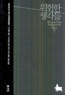

# 위험한 생각들 (What Is Your Dangerous Idea?)

- `Editor`: John Brockman
- `Translator`: 이영기
- `Publisher`: 갤리온
- `Year`: 2008 (1st edition: 2007)

> 주의: 요약과 문장 번역을 제 마음대로 하기 때문에 부정확할 수 있습니다.

## 읽기 전

알라딘에 갔는데 표지가 신기해서 샀다.

존 브록만이라는 사람이 당대 여러 학자들한테 "당신에게 위험한 생각은 무엇인가?"라는 질문, 즉 과학적으로 설득력이 있는데 사회적으로 위험할 만한 게 뭐냐는 질문을 던지고, 서너 페이지 정도 길이의 답변들을 받아 하나로 엮은 책이다.

존 브록만은 [Edge](https://edge.org)라는 인터넷 포럼을 만든 사람이라고 해서 들어가 봤다. 사이트에는 Annual question이라고 1년에 한 번씩 질문 주제를 하나 잡고서 여러 사람한테 답변을 받아 정리하는 이벤트가 있다. 2018년까지 하고 멈춘 것 같다. 대충 봤는데 2017년에 진행한 "어떤 과학적 용어/개념이 더 널리 알려져야 한다고 생각하는가?"랑 2012년 "가장 좋아하는 심원한/수려한/아름다운 설명은 무엇인가?" 파트가 재미있어 보인다.

이 책의 토대가 된 질문은 해당 사이트에 2006년도에 올라왔고, 답변을 엮어 출판은 2007년에 했다. 거의 20년이 되어가는 현 시점(2025년 말)에서 과연 그때 지식인들이 던진 질문은 뭐였을지 흥미롭다.

## 대략 감상

"아 그때 이게 트렌드였구나" 싶은 주제들이 있다. 진화심리학... 가상현실... 게놈 프로젝트... 나노봇... 인간은 특별한가... 물론 중요한 주제들이지만 책을 읽다 보면 꽤 많은 사람이 같은 주제로 이야기를 한다. 그때는 이쪽 분야가 정말 논쟁거리가 많이 되었구나 싶다.

읽다가 문체 때문에 살짝 지치는 감이 있었다. 번역의 문제일 수도 있겠지만 영어로도 비슷할 것 같은 게, 애초에 학자들한테 "당신에게 위험한 생각은 무엇인가?"라고 아주 도전적인 질문을 한 것 아닌가? 그럼 당연히 대답하는 학자들도 매우 중요한 질문을 매우 엄숙하게 던지는 논조로 답변했을 것인데 그 중에서 제일 진지한 것들을 뽑아서 엮었을 테니... 그래서 페이지 두 장 넘길 때마다 새로운 학자가 나와서 "내가 정말정말 위험한 생각이 있는데 들어봐라" 하고서 용어를 막 때려박는 경우가 있다.

그런데 또 페이지의 제한이 커서 설명을 친절히 하지는 않는다. 제일 킹받는 것 중의 하나가, 이분들이 '자유의지' 얘기를 자꾸 꺼내는데 말하는 사람마다 정의가 조금씩 다른 것 같다. 근데 지금 자기가 뭔 뜻으로 자유의지라는 말을 쓴 건지 설명해주는 사람이 없다. 그냥 큰 갈래로 '우리의 행동이 물리학적으로 미리 결정되어 있다면 자유의지는 존재하지 않는 것인가?'와 같은 질문이 당시에도 큰 화두였다는 것 정도만 느껴졌다. (요즘은 이런 식의 질문에 대한 피로가 좀 쌓여서, 제대로 된 설명 없이 자유의지 같은 개념을 물리학과 연관지으려는 시도에 반박하는 쪽이 많아진 것 같다. 예를 들면 최근 유튜버 Angela Collier의 영상 [is free will a physics question?](https://youtu.be/OP4hidZpl7g?feature=shared)이 있겠다. 내 의견도 이쪽으로 기울었다.)

## 특별히 재밌었던 / 별로였던 글

제일 좋았던 글들과 제일 별로였던 글들을 같이 나열하겠다. 좋아서 넣었는지 별로여서 넣었는지는 안 적겠다

### ◆ Clifford Pickover - "멀티 라이프 - 우리는 모두 가상이다" (40p)

**"앞으로 뇌를 더 깊이 이해하게 되면, 우리는 통제된 환상을 더 많이, 더 안전하게 창조할 수 있을 것이다."** 라고 주장한다. **"미래의 우리들은 10개의 시뮬레이션 라이프를 만들어낼 수 있을 것이다. 낮에 하는 일은 IBM 컴퓨터 프로그래머이지만 퇴근 후에는 반짝거리는 갑옷을 입은 중세의 기사로써..."** 등등. 그냥 가상현실이 아니고 포인트가 뭐냐면 **"가짜 기억을 주입해, 한시적으로 당신의 현실 기억을 덮어버릴 수도 있다."** 처럼 본인이 그때는 진짜 중세 기사라고 믿게 만들 수 있을 거라는 것이다.

그러한 기술이 왜 발전을 할 거라고 생각하는지, 그 당위성은 별로 없었던 것 같다. 아마 매트릭스처럼 "그럼 내가 지금 사는 현실이 진짜 현실인지는 어떻게 알지?"같은 유명한 질문하고 연결이 잘 되어서 이런 주제로 글을 쓰지 않았을까 생각이 든다.

### ◆ Barry C. Smith - "인간에 대한 지식이 인간을 변화시키지는 못할 것이다" (68p)

**"우리는 다른 사람들을 단순한 기계로 대하지는 못할 것이다. 설령 인간은 기계적인 존재라는 것이 진실로 판명이 나더라도 말이다. 앞으로 과학이 아무리 새로운 사실을 밝혀내더라도, 우리가 가진 자신에 대한 개념(self-conceptions)은 거의 그대로 강하게 남아 있을 것이다. 과학적 사실과 무관하게 인간의 존재 방식이 앞으로도 지금과 큰 차이 없을 것이라는 예상은 빗나가지 않을 것이다."** 라고 주장하는데, 과연 어떨까?

### ◆ Richard Dawkins - "범죄자가 아니라, 범죄자의 유전자를 벌하라" (93p)

이름이 익숙한 저자다. 이 책을 읽을 때 이 앞까지는 다 한 번쯤 들어본 얘기라 '음... 그렇게 위험한 얘기들은 아닌데?' 싶었는데 여기서 처음으로 '오 이건 진짜 위험한데?' 했다. 최대한 순화해서 요약하자면...

> 사고실험을 해 보자. 우리는 누가 범죄를 저질렀을 때 당연히 그 사람을 비난하고 형벌로 책임을 지게 하려 한다. 그런데 그게 일반적이지 않은 사회도 있을까? 누가 범죄를 저질렀을 때 비난도 안 하고 벌도 안 주고, 그냥 고장난 자동차를 수리하듯이 그 사람의 생리와 유전자, 처한 환경을 파악하여 고치기. 그렇게 작동하는 사회가 존재할 수 있을까? 저자(Richard Dawkins) 본인도 본능적으로 거부감이 들긴 하는데, 왠지 그렇게 하는 게 과학적인 것 같아서 미래에는 진짜 그럴 수도 있을 것 같다. 그래서 오히려 좀 무섭다.

사실 원래 글은 오히려 설득력이 없고 좀 감정적으로 쓴 것 같다는 느낌이 들었다. 그래서 최대한 순화해서 썼다. 그래도 허점이 있는 것 같은데 몇 개 짚어보자면,

1. 형벌 자체가 범죄를 예방하는 의미도 가지고 있는데, 그 부분을 그냥 넘겼다.
2. '과학'은 뭐가 옳다 그르다를 말할 수 없지 않나? '과학적으로 봤을 때' 범죄자를 비난하는 건 틀렸고 유전자를 분석하는 건 옳다...이렇게 말할 수는 없는 게 아닌지.
3. 사람한테 책임을 지우지 않고 생리/유전/환경적 요인에 책임을 지운다는 얘기인데, 생리/유전/환경을 다 고쳐서 이상적인 인간을 만들려 해도 우연은 어떡하는가? 우연적 요인도 있는데. 아무리 데이터 분석을 해도 오차항은 존재하고, 아무리 환경을 통제하려 해도 카오스적 요소 때문에 예측이 불가능한 것처럼. 인간 사회 정도로 복잡한 체계면 전부 카오스 아닌가? 유전자부터 환경까지 완벽하게 만들어 놓았는데도 누가 범죄를 저질렀으면? 우연한테 책임을 지울 수는 없지 않나?

### ◆ Paul Bloom - "영혼은 뇌와 상관없이 독자적으로 존재할 수 없다" (109p)

이 사람의 입장이 당시 미국 대중의 생각과 비교했을 때 어땠을지 생각해 보는 게 흥미롭다. **"나는 자유의지가 아예 존재하지 않는다고 보는 과격한 주장에는 아무런 관심이 없다. 그런 견해에 장점이 없는 것은 아니지만, 직관적으로 보기에 너무 유별난 주장이다. 철학자를 제외하고는 아무도 진지하게 받아들이지 않을 것이다. 그런 주장은 실제 세계와 아무런 연관이 없다."** 라고 처음부터 말하는데, 같은 책에 자유의지의 존재 여부를 논한 사람들이 수두룩하다는 걸 감안하면 진지하게 받아들인 사람은 사실 많았던 것 같다.

그리고 저자(Paul Bloom)가 생각하는 당대 과학적 담론에 대해 적은 문장을 몇 개 가져왔는데 현재의 내가 느끼는 정서랑 비교해 보게 된다.

- **"대중들은 영혼이란 뇌를 비롯한 육체와는 아무 관련이 없다고 본다."**
- **"...영혼을 단념하는 것은 인간과 다른 동물 사이의 선험적 구별을 포기하는 것과 같다..."**
- **"지적인 분석가들이 '우리가 하는 행위'와 '우리의 뇌가 하는 행위'를 구별하는 것은 비물질적인(뇌와 독립적으로 존재하는) 영혼의 존재를 믿기 때문이다. 우리가 하는 행위에만 책임을 질 수 있고, 뇌가 하는 행위에 대해서는 신경과학자인 Michael Gazzaniga가 '내 뇌가 그것을 하도록 시켰다'라고 표현한 것처럼 변명의 여지를 갖게 된다. 일례로 소아 성애증을 보이는 사람이 어린아이와의 성교를 상상할 때 뇌의 특정한 부위가 활성화되는 패턴을 보여준다면, 그에게 그의 행위에 대해 전적인 책임을 물을 수 없다는 주장이 제기되어 왔다."**

### ◆ Rodney Brooks - "우리는 우주에 홀로 존재한다" (133p)

이 책을 100페이지쯤 읽으면 본능적인 습관이 생긴다. 각 챕터마다 저자 이름 밑에 약력이 나와 있는데, 거기서 이 사람이 무슨 학문으로 유명한지 보고, 그게 이 사람이 지금 말하려는 내용이랑 같은 분야인지 확인을 하게 된다. 이번 저자는 약력에는 'MIT의 컴퓨터과학 및 인공지능연구소 소장'이라 나와 있는데 글의 주제는 우주과학이다. 내용을 보아하니 '혹시 우주에 우리 말고 생명체가 없을 것 같다는 증거가 과학적으로 나오면 어떡할까' 물어보고서, **"태양계에 인류만 홀로 존재한다는 사실은 그다지 큰 충격은 아닐 것이다. 하지만 태양계보다 훨씬 더 넓은 은하계와, 심지어 우주 전체를 통해 인간만이 홀로 존재한다는 것을 알게 된다면, 아마도 우리는 절망감을 느낄 것이고, 마음의 위안을 찾으려고 종교로 후퇴하지는 않을까."** 이렇게 마무리하는데... 실례가 되겠지만 뻔하게 중2병 같았다. 읽다 보니 자기 전문분야에 대해 쓴 사람이랑 그렇지 않은 사람이랑 퀄리티 차이를 느꼈다.

### ◆ Scott Sampson - "생명의 목적은 에너지를 분산시키는 것이다" (135p)

글의 주제는 다음과 같다. **"흔히 생명의 복잡성은 열역학 제2법칙에 위배된다는 말을 많이 해왔다. 생명은 신이나 우리가 알지 못하는 어떤 자연 과정을 통해 출현했기 때문에 열역학 제2법칙과는 무관하다는 것이었다. 그러나 생명의 진화와 생태계의 역학은 주로 에너지를 발산하면서 제2법칙의 명령을 따른다."**

단점이 몇 개 있다. 이번에도 해당 분야에 대해 잘 아는 사람이 설명해주는 느낌이 아니다. 글에 나오는 과학적인 설명은 조각조각 분석했을 때 틀렸다고는 할 수 없는데, 그게 좀 이상하게 결합이 되어서 핀트를 흐리는 느낌이다. **"열역학적 관점에서 보면, 생태계의 연속된 과정은 에너지의 포획과 감소(분해)를 극대화하는 과정이다. 마찬가지로, 지난 35억 년에 걸쳐 생명이 점점 더 복잡해지게 된 것은 대다수의 진화론자들이 주장하듯이 자연선택의 결과만이 아니라, 햇빛을 더 많이 잡으려는 노력의 산물이다."** 이렇게 설명했는데, 읽을 때 걸리는 지점이 좀 많다. 어떻게 읽게 되냐면, *'생명이 점점 더 복잡...해진 건 맞지. 뭐 단세포에서 다세포 등등. 근데 35억 년에 걸쳐? 35억 년 전체 동안 계속 복잡해졌다고 해도 되나? 음... 햇빛을 더 많이 잡으려는 노력? 햇빛을 옛날보다 지금 더 많이 잡나? 이게 절대적인 양을 말하는 건가? 뭐 어떤 나무 한 종이 점점 햇빛을 더 잘 받게 진화했다는 건 그럴 수 있는데... 그리고 자연선택의 결과만이 아니라고? 이 문구는 왜 있지? 햇빛을 더 많이 잡게 되는 것도 자연선택인 거 아닌가?'*

그리고 상당히 드라마틱하게 쓰였다. **"물질의 복잡하고, 순환하고, 소용돌이치는 시스템은 점점 더 에너지 경사 속으로 들어가는 경향이 있다. 주기적으로 되풀이되는 이 현상들은 생명 기원의 배후에서, 생명을 탄생시키는 힘이 되어왔는지 모른다. 이러한 생각은 새로운 것이 아니며, 내가 생각해낸 독창적인 것도 아니다."** 이렇게 말씀하시는데 정말 죄송스럽지만 "내가 생각해낸 독창적인 것도 아니다" 이 문구 때문에 오히려 으스대는 것 같아서 킹받습니다... 그리고 한 페이지 뒤에는 **"내가 보기엔 지구와 공기, 물, 생명은 에너지의 흐름을 일정하게 유지하기 위해 물질을 순환시키는 과정에서 서로 연결돼 있을 뿐 아니라, 서로 독립적이기도 하다는 것을 연구자들이 완전히 이해하게 될 때, 진화론과 생물학은 큰 진전을 보이게 될 것이다."** 이렇게 쓰셨는데 이건 정말로 으스대는 것 아닙니까? 드디어 가면을 벗으셨군요 교수님?

### ◆ Jeremy Bernstein - "플루토늄을 이해하고 있다는 착각" (147p)

이건 짧고 굵었다. **"플루토늄은 주기율표에서 가장 복잡한 원소이다. ...핵무기에 내장된 단지 안에서 플투토늄은 갈륨과 결합해 합금이 된다. 그러나 아무도 어떤 과정을 통해 갈륨과 결합해 합금이 되는지 이해하지 못하고 있다. 게다가 이 합금이 얼마나 안정적인지에 대해서는 그 누구도 확신을 못한다."**

그걸 설마 모르면서 핵무기를 만들었다고? 그런데 핵무기가 얼마나 경쟁적으로 개발되었는지를 생각해 보면 이론적 토대 없이 시행착오로 '일단 괜찮은 결과를 내기' 식으로 만들어진 부분도 많겠다. 그러면 지구는 운이 좋아서 아직 안 멸망한 건가? 오펜하이머 영화에서 나왔던 "대기의 점화" 이론, 실험 직전까지 세계 멸망 확률이 0인지 아닌지 확신하지 못하던 장면도 생각났다.

### ◆ Kevin Kelly - "익명성은 통제되어야 한다" (205p)

**"익명은 희토류 금속과 같다"** 는 난생 처음 듣는 비유가 나온다. **"아주 적은 미량의 원소처럼, 익명은 가끔 내부 고발자나 박해받는 비주류파에게 기회를 주기 때문에 어떤 면에서는 유익하다. 그러나 익명의 양이 많으면, 언젠가 익명은 시스템을 독살하고 말 것이다. 또한 사람들은 익명을 언제나 손쉽게 선택할 수 있어야 하며, 익명을 보장하는 것이 통제 기술에 대한 뛰어난 방어 수단이라고 믿는 경향이 있다. 그러나 이것은 위험한 생각이다. 이것은 몸을 더 강하게 하려고 몸속의 중금속량을 늘리는 것과 같다."** 익명성보다 유사익명성(psuedoanonymous)이 낫다는 주장 같다. 현재의 저자는 같은 주제에 대해 어떻게 생각할지 궁금하다.

### ◆ Paul W. Ewald - "의학 황금시대가 건강을 위협할 것이다" (208p)

일단 약력을 보니까 "생물학 교수이며, 진화의학이라는 새로운 분야를 창안 선도하고 있다"고 한다. 글이 또 상당히 드라마틱한데, 문장을 몇 개 추려보자면 **"나의 위험한 생각은, 의학의 새로운 황금시대를 촉진하는 데 필요한 정보 대부분이 우리 수중에 있다는 것이다. (...) 만약 중대한 질병—암, 동맥경화증, 뇌졸중, 당뇨병—이 지금보다 훨씬 효과적으로 예방된다면 어떻게 될지 상상해 보라. (...) 진리는 처음에는 비웃음을 당하고, 그 다음에 격렬한 반대에 부딪치고, 마지막에 자명한 것으로 받아들여진다. 바로 몇몇 병원균 집단이 주인공인 것 같다. 즉 연쇄상 구균, 클라미디아, 약간의 구강 박테리아, 간염 바이러스와 헤르페스 바이러스이다. 만약 이 병원균들과 부유한 국가들에서 발생하는 중대한 질병 사이의 상호 관련성에 대한 연구가, 이 질병들이 실제로 전염성을 갖고 있음을 밝혀낸다면, 이 병원균들에 대한 효과적인 백신의 개발은 20세기 중반에 이루어진 업적에 필적할 만한 새로운 의학의 황금시대를 여는 데 크게 기여할 것이다."**

이게 내가 제대로 이해했는지 모르겠는데, '암이나 당뇨병이 사실 전염병일 것이고 쉽게 예방이 가능할 것이다, 그걸 우리가 밝혀낼 것이다' 이런 느낌이 맞나? 왜 이렇게 사짜 과학 느낌이 들지? 저자는 이 다음에 5페이지의 지면을 더 할애해서 이 혁신적인 발견이 일어나려면 정부와 제약회사가 어떻게 바뀌어야 하는지, 어느 분야에 연구를 집중해야 하는지 얘기하는데... 아주 흥미로운 부분이 있다. 당시 H5N1 조류 독감 바이러스라는 게 유행했는데, 세계보건기구와 질병예방센터에서 이것이 '1918년의 세계적인 유행성 독감과 유사하거나, 그보다 더 절박한 위협을 불러일으키고 있다'고 성명서를 냈고, 저자는 여기에 의문을 제기했다가 비난을 받았다고 한다. **"나는 1918년의 독감 바이러스는 제1차 세계대전 당시, 서부 전선이라는 특수한 조건과 상황이 강한 병독성과 높은 전염성을 결합시키는 바람에 진화했다고 보고 있다. (...) 이런 혹독한 전쟁 상황은 이후에는 다시 나타나지 않았고, 이후 서부 전선에서 나타난 것만큼 유해한 독감 바이러스는 발생하지 않았다. 그러한 상황이 재발하지 않는 한, 우리는 그러한 약탈성 바이러스의 재진화를 두려워할 필요가 거의 없다."** 진화의학이라는 분야를 창안한 학자답게, 세계적으로 유행하는 바이러스가 진화할 만한 조건(전쟁 상황 등)이 충족되지 않았다면 그런 바이러스를 두려워하는 건 쓸데 없다는 건데... 2020년대에는 과연 어떻게 생각하실지 궁금하다.

### ◆ David G. Myers - "동성애자들에게 결혼을 허하라" (222p)

대학교 1학년 때 배웠던 "마이어스의 심리학개론"으로 익숙한 저자다. 내용은 동성애 결혼에 관한 현재의 담론과 거의 같다. **"나는 성 정체성, 동성애자냐, 이성애자냐, 양성애자냐 하는 것은 자연적으로 한번 정해지고 나면 영구적이라는 것과, '모든 사람이' 낭만적인 사랑과 섹스와 결혼을 하나로 결합할 수 있다면, 세상은 더 행복하고 더 건강한 곳이 될 것이라는 사실을 증거에 의해 진실이라고 믿는다."** 2006년에 썼기 때문에 신기하다.

### ◆ Rudy Rucker - "모든 물체가 마음을 가지고 있다" (278p)

마음(자아?)이란 게 인간뿐 아니라 모든 사물에 존재한다는 범심론(panpsychism)에 관한 이야기다. 범심론에도 여러가지가 있을 수 있는데 여기에서는 원자 하나하나도 마음을 가지고, 세포 하나는 그것대로 세포의 마음을 가지고, 그게 모인 사람은 또 사람의 마음을 가지는 식으로 작은 마음이 모여서 이루어진 것이라는 느낌이다. 개인적으로 설명이 너무 미신적이라 마음이 안 가고, 설명에 통일성이 없다는 느낌도 든다. **"모든 물리 체계는 하나의 계산을 구체적으로 나타내는 것이라는 점을 지적하겠다. 그리고 대개의 간단하지 않은 체계는, 보편적인 계산을 구체화한 것으로 볼 수 있다. 그것은 다른 어떤 체계도 조금이나마 모방할 수 있다. 마음을 가진다는 것은 어떤 의미에서는 보편적인 계산을 할 수 있다는 것과 같다고 할 수 있을 것이다."** 이렇게 나오는데 첫 문장의 체계란 말은 예컨대 '뉴턴의 역학' 같은 진짜 물리 법칙 체계랑 가까운 것 같고, 세 번째 문장의 체계란 말은 예컨대 '신경계'나 '닫힌 계'에서 쓰는 계라는 의미랑 가까운 것 같다. 용어가 정확하지 않고 막 뒤섞여서 논리를 못 따라가겠다. 그 외에 **"하나의 전자처럼 아주 간단한 체계조차도 만약 구조화된 입력이 계속 제공된다면, 구체적인 범용 계산을 할 수 있을 것이다. 전기장 혹은 자기장 속에 놓인 전자를 생각해보라."** 이렇게 나오는데 이건 전자 하나에 마음이 있다는 주장이 아니지 않나? 자아가 있다고 해도 해당 전자가 뭐든지 할 수 있게 만들어주는 것(전기장, 자기장, 구조화된 입력 등)까지 포함한 전체적인 시스템이 자아를 가진다고 봐야 하는 것 아닐까?

개인적으로 범심론 얘기는 분리뇌 연구(한 인간의 의식이 어떻게 여러 개로 쪼개질 수 있을지 보여준 거) 등이랑 합쳐서 그쪽 방향으로 얘기하는 편이 설득력이 있다고 생각한다.

### ◆ Jared Diamond - "부족민들은 환경을 파괴하고 전쟁을 일으킨다" (336p)

역시 유명한 분이다. 부족민들을 존중해야 한다면서 **"그들이 점잖고 지혜롭고, 평화를 사랑하기 때문에 환경을 손상하거나 전쟁을 일으키는 일 따위는 하지 않기 때문"** 이라고 근거를 대는 사람들이 있는데, 이건 잘못되었다는 얘기다. 그들을 존중해야 하는 이유는 그냥 모든 사람들을 존중하는 것이 윤리적으로 옳기 때문이고, 그들이라고 환경 파괴나 전쟁을 안 한다는 설은 사실적으로도 맞지 않다는 것이다.

이 글에서는 생각할 거리가 있었다. 이 외에도 윤리적으로 좋은 의도를 가진 주장 같은데 근거가 윤리에 기반한 게 아니라서 좀 주의해야 하는 케이스가 때때로 있다. 예를 들면 '닭은 좁은 우리에 가두지 말고 자유롭게 방목해 길러야 한다. 자유롭게 기른 닭이 낳은 달걀이 영양학적으로 더 우수하기 때문이다.'와 같은 주장이 있겠다.

### ◆ Simon Baron-Cohen - "감정이입에 근거한 정치 체제를 설계하라" (364p)

과학과 철학 얘기가 대부분인 책에서 눈에 띄어 가져왔다. 조직화하고 투쟁해서 이기고 자기 편을 위해 행동하는 정치인을 양성하는 시스템 말고 다른 사람의 감정과 동일시할 수 있는 정치인을 양성하는 시스템이 필요하다는 얘기다. 저자는 남아공의 흑인 차별 정책을 두고 협상을 했던 넬슨 만델라와 데 클레르크를 롤 모델의 예시로 든다. 구체적인 대안 얘기는 없지만 언제나 중요한 주제 같다.

### ◆ Ray Kurzweil - "삶의 혁명적 연장은 행복하다" (380p)

- **"과학 기술의 힘이 매년 두 배로 증가하는 것을 고려한다면, 불과 20년 후에는 인간의 평균 수명이 비약적으로 늘어날 것이다."**
- **"21세기 후반에는 깨끗하고 재생 가능한 방식으로 에너지 수요를 충족시킬 수 있을 것이다. 분자 나노 조립 장치는, 광범위한 영역에서 우리가 필요로 하는 거의 모든 것을 만들어낼 수 있을 것이다. (...) 결과적으로 인구 증가에도 불구하고 빈곤과 오염은 사라질 것이다."**
- **"바이오 테러리스트들이 새로운 생체 바이러스를 제조할 수 있는 가능성 (...) 2020년대 후반에는 스스로 복제를 하는 나노 기술 같은 문제들이 불거질 것이다."**

과연 몇 개나 맞을까? 일단 1번은 확실히 틀려 보인다. 3번을 보자면 앞쪽 부분은 코로나 이후로 특히 많이 이슈화된 걸 보면 충분히 가능한 얘기 같고, 뒤쪽 부분은 아직 아닌 거 같긴 한데 2030년까지 5년 남았으니 기다려보자. (사실 2025년 현재에도 AI의 기하급수적인 발전으로 2029년에는 나노봇이 모든 걸 뒤덮는다 이런 주장도 존재한다.) 근데 확실히 2005년의 트렌드였는지 이 글은 AI는 적게 언급하고 나노 기술에 초점을 두고 있다.

Ray Kurzweil은 2005년에 "The Singularity Is Near(특이점이 온다)" 책을 내고 2024년에 "The Singularity is Nearer(마침내 특이점이 시작된다)" 책을 냈는데 두 개 비교해서 읽어보면 재밌겠다. (사실 안 읽을 것 같다)

### ◆ Michael Shermer (397p) + Matt Ridley (400p) + Mihaly Csikszentmihalyi (404p)

앞의 두 명은 자유시장(작은 정부) 옹호, 세 번째 사람은 자유시장 비판이다. 나란히 배치해 놨는데 책의 구조상 토론이 불가능하고 각자 겨우 2장 동안 자기 할 말만 하고 빠지는 게 아쉽다.

### ◆ Juan Enriquez - "미래의 부는 기술교양이 결정한다" (419p)

2006년 기준으로, 근미래를 예측했다기엔 지나칠 수도 있지만 이런 부분이 있었다. **"각 가정이 짊어진 부채(빚)의 규모가 증가하면서 폭발 직전의 상황이다. 가구당 평균 부채는 88,000달러가 넘는다. 미국 정부는 눈덩이처럼 불어나는 재정적자를 해소할 의지가 거의 없고, 재정(회계) 불균형에 대해 신경도 쓰지 않는다. (...) 조만간 우리는 누가 이득을 취하고 누가 대가를 치르게 되는지, 쓰라린 결과를 목도하게 될 것이다. 여러 선진국의 예에서 보듯이, 정치적인 자율을 획득하고 다른 지역과의 분리에 성공하는 것은 민족적으로나 종교적으로 억눌려 있는 곳이 아니라, 가장 부유한 지역이라는 것을 알 수 있다."**

### ◆ Leo M. Chalupa - "24시간의 절대 고독" (437p)

말 그대로 24시간 동안 아무와도 의사소통을 하지 않고 방해 없이 생각만 하는 수련을 해 보자는 것이다. 내일 한 번 해 볼까?

